# Changelog

Every version is built for all platforms and attached to its [GitHub release](https://github.com/gtko/ai-slop-arena/releases).
Full notes, with downloads: [docs/releases](docs/releases).

## [v0.13.0](docs/releases/v0.13.0.md): Level up

<a href="docs/releases/v0.13.0.md">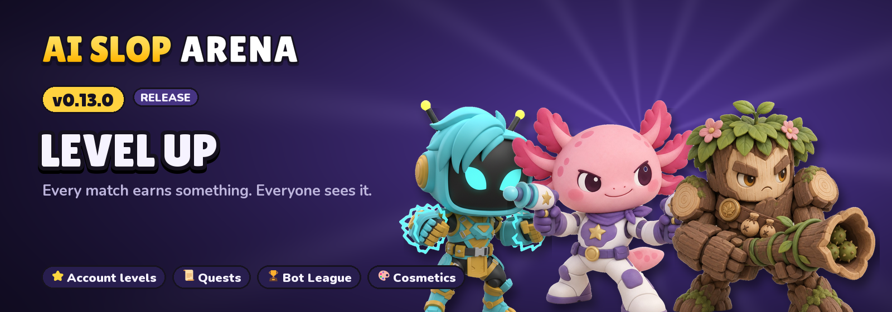</a>

- ⭐ Account levels, daily and weekly quests, a Bot League with its Trophy Road.
- 🎨 Slop Coins earned by playing, a daily shop, recolours, golden figurines, trails, K.O. effects, frames and titles.
- 😀 Emote wheel, a result podium with awards, bots with personalities.
- 🌋 An event on every arena and a Weekly Chaos twist. Update required to play online.

## [v0.12.0](docs/releases/v0.12.0.md): Gadgets

<a href="docs/releases/v0.12.0.md">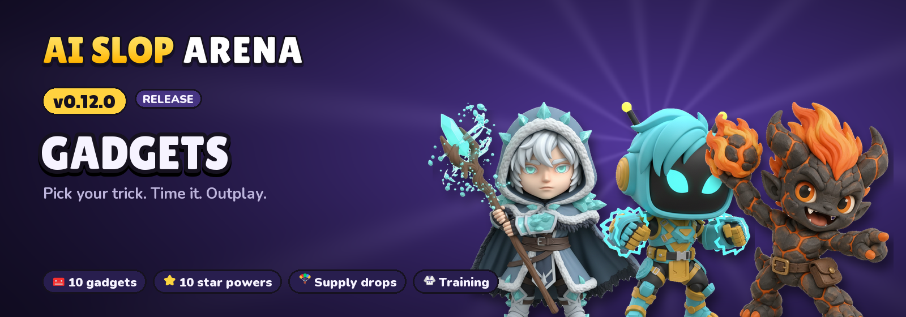</a>

- 🧰 10 gadgets and 10 star powers, unlocked with mastery; pick your loadout before the match.
- 🪂 Supply drops, a bounty crown on the cube leader, supers you can see coming.
- 🤖 Smarter bots; every brawler within 44-58% top 4.
- 🥋 Training dojo, a result stat card with the MVP.

## [v0.11.0](docs/releases/v0.11.0.md): Impact

<a href="docs/releases/v0.11.0.md">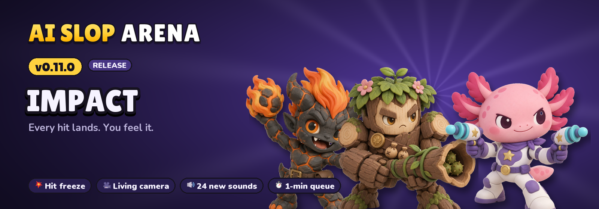</a>

- 💥 Hit freeze, jelly squash, a living camera, K.O. stamps, kill feed and a slow-motion finale.
- 🔊 24 new sounds: own weapon sounds, voices, footsteps, match stings.
- ❤️ Big health bar, team outline colours, a colour-blind option, eyes that react.
- ⏱️ Online matches start within a minute; 1.5 s of immunity after a freeze.

## [v0.10.1](docs/releases/v0.10.1.md): Fair hits

<a href="docs/releases/v0.10.1.md">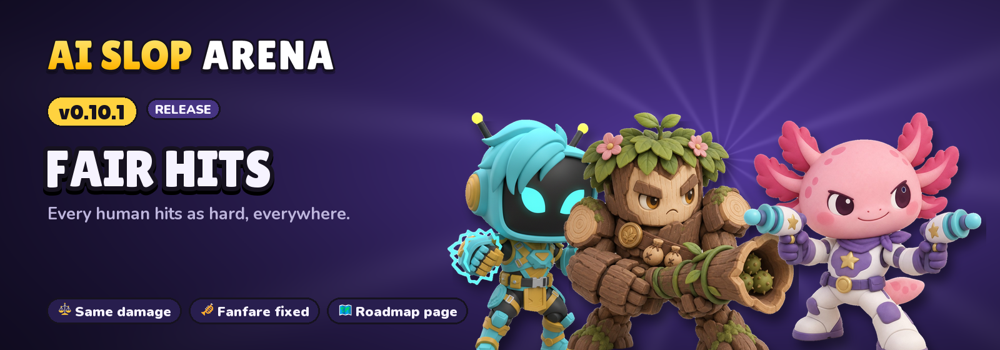</a>

- ⚖️ Every human hits at 100% online and in Steam lobbies (it was 85%, except for the Steam host).
- 🎺 The victory fanfare stops when the next match starts.
- 🗺️ New roadmap page on the website: six versions, seven new brawlers.

## [v0.10.0](docs/releases/v0.10.0.md): Line of sight

<a href="docs/releases/v0.10.0.md">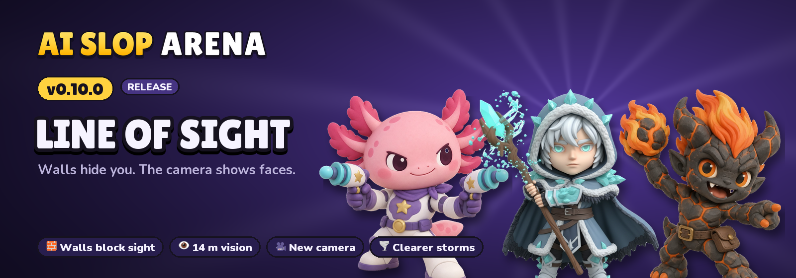</a>

- 🧱 Walls, trees and crates hide brawlers; what you cannot see is greyed out.
- 👁️ 14 m of vision (11 m in the sandstorm); bots and online play follow the same rules.
- 🎥 Lower, wider camera: you see the brawlers' faces.
- 🌪️ Rain and sandstorm no longer bury your brawler in fog.

## [v0.9.0](docs/releases/v0.9.0.md): Alive!

<a href="docs/releases/v0.9.0.md">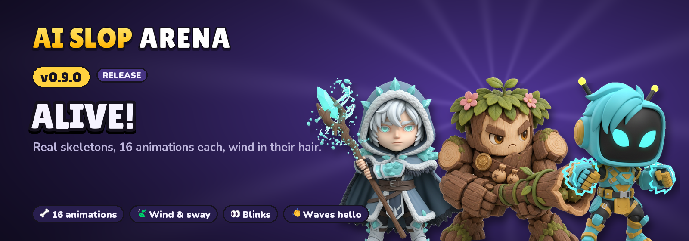</a>

- 🦴 Real skeletons and 16 animations per brawler: sneaking in bushes, victory dance, knocked-out fall, waves, fidgets...
- 🍃 Leaves, flames, gills, capes, hair and antennas sway with the wind and the motion.
- 👀 Brawlers blink; weapons are held in hand and put away to wave hello.
- 🧰 Rigged characters also as .glb, .fbx and .blend files for other 3D tools.

## [v0.8.0](docs/releases/v0.8.0.md): New looks

<a href="docs/releases/v0.8.0.md">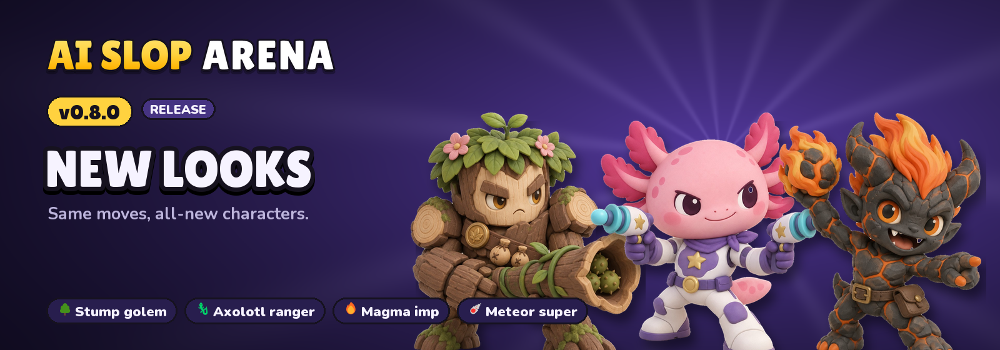</a>

- 🌳 Blaster is now a tree-stump golem firing thorny seeds from a log blunderbuss.
- 🦎 Gunslinger is now an axolotl star-ranger with twin ray pistols.
- 🔥 Bomber is now a magma imp with flickering flame hair, fireballs and a meteor super.
- 🎨 Same gameplay; new models, portraits, projectiles, store art and texts in 30 languages.

## [v0.7.0](docs/releases/v0.7.0.md): Made with you

<a href="docs/releases/v0.7.0.md">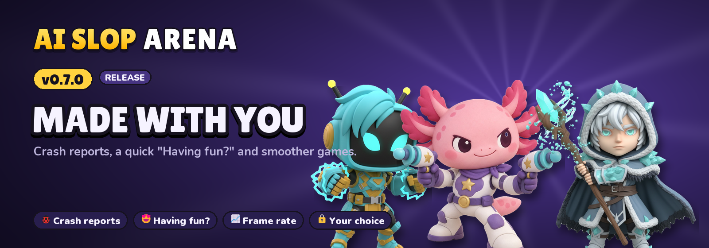</a>

- 🐞 Crash reports from the game and the online server, linked to in-game bug reports.
- 📊 Anonymous game statistics: brawlers, maps, queue times, frame rate per device.
- 😍 A quick "Having fun?" on the result screen, at most once a month.
- 🔒 Both switchable in Options > General; privacy policy updated.

## [v0.6.2](docs/releases/v0.6.2.md): 15 achievements

<a href="docs/releases/v0.6.2.md">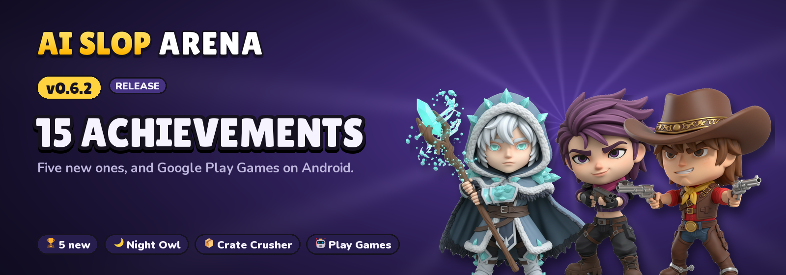</a>

- 🏆 Five new achievements: Podium Finish, Super Finish, Night Owl, Crate Crusher, Champion (15 in all).
- 🤖 Google Play Games on Android: automatic sign-in, the same achievements, an ACHIEVEMENTS button.
- 🌍 Every new text in the 30 languages, Steam store pages updated.

## [v0.6.1](docs/releases/v0.6.1.md): New online menu

<a href="docs/releases/v0.6.1.md">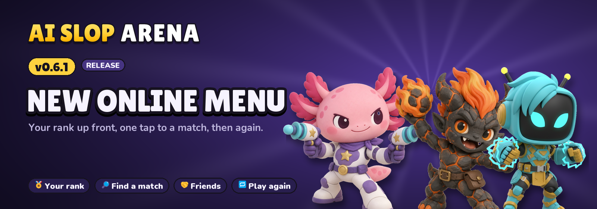</a>

- 🧭 Online menu rebuilt: your rank and progress, one big Find a match button, friends tiles; fits phones.
- 🔁 After a ranked match: RP gained or lost, then Play again or Menu (no more empty room).
- 🔒 Privacy policy page for the app stores.

## [v0.6.0](docs/releases/v0.6.0.md): Ranked & fair

<a href="docs/releases/v0.6.0.md">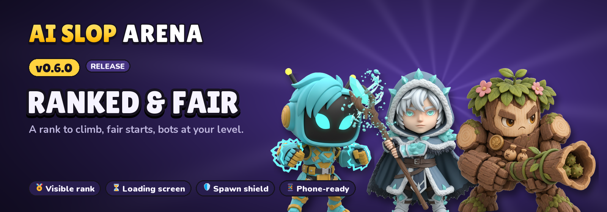</a>

- 🏅 Visible rank (RP, Bronze to Legend) and hidden MMR for matchmaking; bots follow your level.
- ⏳ Loading screen that waits for everyone, synchronised 3-2-1, 5 s spawn shield, calm bots at start.
- 🐞 In-game bug reports; 📱 phone layout and much lighter mobile rendering.
- ⚠️ Online play needs this version.

## [v0.5.0](docs/releases/v0.5.0.md): Find a match

<a href="docs/releases/v0.5.0.md">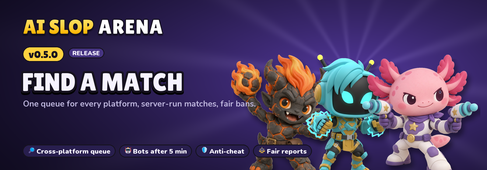</a>

- 🔎 Cross-platform matchmaking: one queue for web, Steam, Epic, Android and iOS; bots after 5 minutes.
- 🛡️ Matches run on our server: every move checked, no wallhacks, cheaters kicked.
- ⚖️ Report and remove players; automatic bans as a share of matches played.
- ⚠️ Online play needs this version (older ones are asked to update).

## [v0.4.0](docs/releases/v0.4.0.md): Auto graphics

<a href="docs/releases/v0.4.0.md">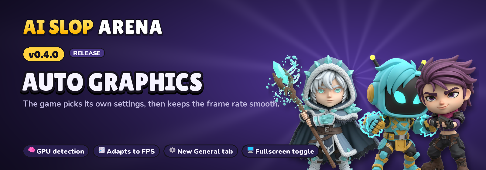</a>

- 🧠 Automatic graphics quality (new default): picked from your graphics card, then adjusted to the frame rate.
- ⚙️ New **General** options tab: language, fullscreen, FPS counter, camera shake, graphics quality.
- 🖥️ The FPS counter shows the chosen tier; the Graphics tab shows your graphics card.

## [v0.3.0](docs/releases/v0.3.0.md): The soundtrack

<a href="docs/releases/v0.3.0.md">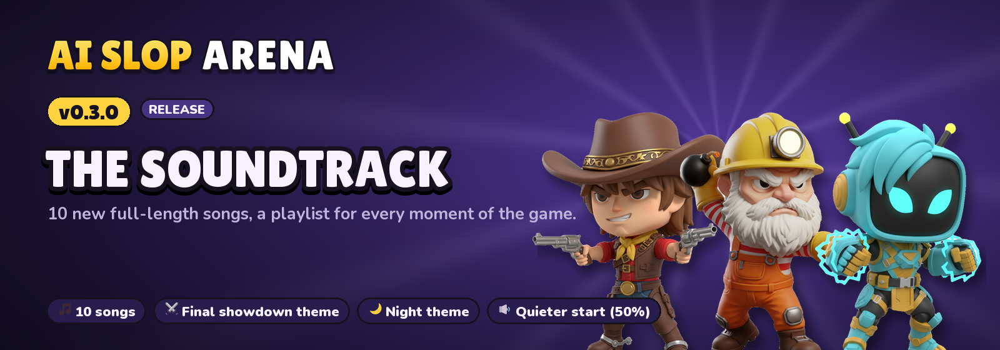</a>

- 🎵 10 new full-length songs (Lyria 3 Pro): full map themes, battle II, final showdown, night, lobby and online room.
- 🔁 A playlist for every moment; the final showdown theme kicks in at 3 brawlers left.
- 🔉 Master volume starts at 50%; music streams instead of filling the RAM.

## [v0.2.0](docs/releases/v0.2.0.md): Now everywhere

<a href="docs/releases/v0.2.0.md">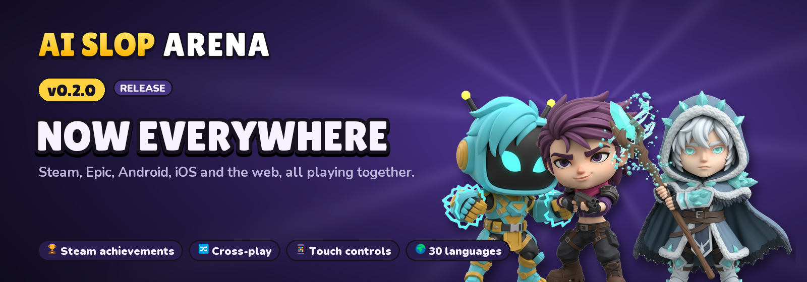</a>

- 🎮 Steam desktop app: achievements, friends, Steam P2P lobbies, overlay.
- 🔀 Cross-play rooms between Steam, web, Epic and mobile.
- 📱 Android and iOS apps with touch controls; 🛒 Epic Games Store build.
- 🌍 30 languages.

## v0.1.0: First release

- The browser game: 5 brawlers, 5 arenas with live weather, real-time lighting, day/night cycle, online rooms. Made in two evenings.
