<p align="center">
  
</p>

<p align="center">
  <b>A cute top-down 3D brawler that runs in your browser.</b><br>
  Brawl Stars–style Showdown in three.js · real-time lighting and shadows · 5 arenas with live weather · online multiplayer
</p>

<p align="center">
  <a href="https://ai-slop-arena.gtux-prog.workers.dev/play"></a>
  <a href="https://ai-slop-arena.gtux-prog.workers.dev/"></a>
</p>

<p align="center">
  <a href="https://ai-slop-arena.gtux-prog.workers.dev/assets/site/trailer.mp4">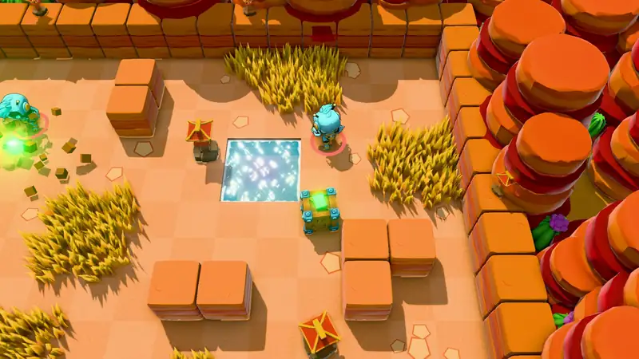</a><br>
  <sub>Real gameplay, recorded straight from the engine. <a href="https://ai-slop-arena.gtux-prog.workers.dev/assets/site/trailer.mp4">Watch the full trailer (25 s, MP4)</a></sub>
</p>

Pick a brawler, hide in the tall grass, smash crates for power cubes and be the last one standing while the poison gas closes in.
Eight players per match: play solo against bots, or create a room and share the link with friends (bots fill the empty slots).
No install, no account: it runs in any modern browser, with mouse and keyboard or a gamepad.

## Made by an AI in two evenings

AI SLOP ARENA was built in **two evenings**, on September 22 and 23, 2026, after the kids went to bed: from 9 pm to midnight,
twice in a row, while watching *Frieren*. So my involvement was very moderate.

**Claude Opus 5.5**, running in **Claude Code Desktop in full-auto mode**, had all the ideas: it wrote the code, generated the assets,
played the game in a browser to test it and fixed whatever was wrong. I only prompted and supervised: 35 prompts between two episodes,
and saying "that's ugly" when it was ugly. The name is an honest nod: **everything** here was made by AI.

| 2 | 35 | ≈ 7,800 | 20 | $2.61 |
| :---: | :---: | :---: | :---: | :---: |
| evenings | prompts | lines of JavaScript | 3D models generated locally | spent on assets |

| Assets | Made with | Cost |
| --- | --- | ---: |
| Illustrations and textures | Nano Banana (Gemini 2.5 Flash Image) via OpenRouter | $2.21 |
| Music | Lyria 3 Pro and Clip via OpenRouter | $0.40 |
| Sound effects and ambiences | ElevenLabs (2,500 credits) | ≈ $0 |
| 3D figurines and decor | Hunyuan3D-2, 100% local on the GPU (AMD, ROCm) | $0 |
| **Total** | | **$2.61** |

Every prompt, with its timestamp, is listed on the [website](https://ai-slop-arena.gtux-prog.workers.dev/#apropos) (in French).

## The brawlers

<table>
  <tr>
    <td align="center" valign="bottom" width="20%">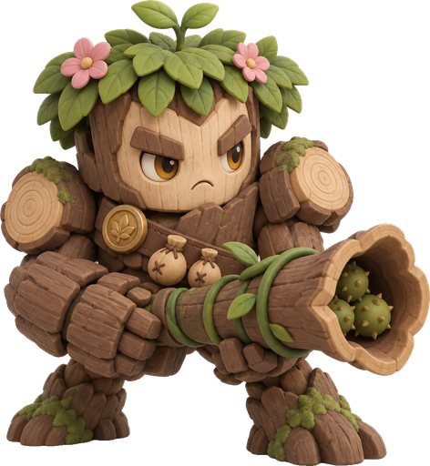<br><b>Blaster</b><br><sub>Shotgun</sub></td>
    <td align="center" valign="bottom" width="20%">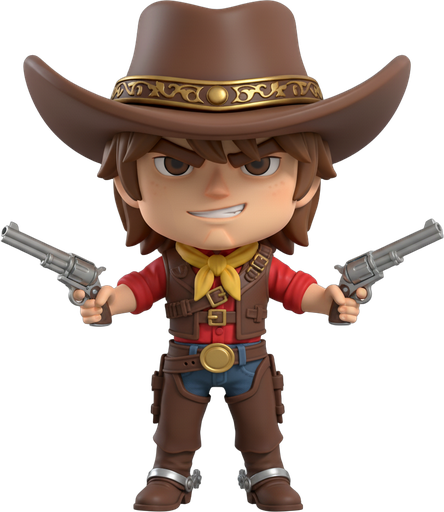<br><b>Gunslinger</b><br><sub>Sharpshooter</sub></td>
    <td align="center" valign="bottom" width="20%">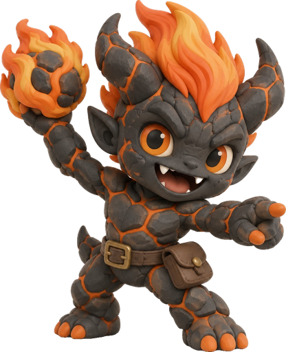<br><b>Bomber</b><br><sub>Thrower</sub></td>
    <td align="center" valign="bottom" width="20%">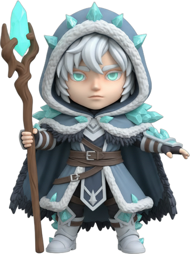<br><b>Frostbite</b><br><sub>Ice mage</sub></td>
    <td align="center" valign="bottom" width="20%">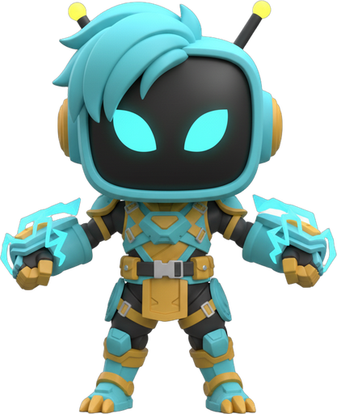<br><b>Volt</b><br><sub>Electric robot</sub></td>
  </tr>
</table>

- **Blaster**: a five-pellet spread at short range. Super: a blast that knocks enemies back and smashes walls.
- **Gunslinger**: a long-range six-bullet burst. Super: a twelve-bullet volley that goes through walls.
- **Bomber**: lobs bombs over cover. Super: a giant barrel that levels everything around it.
- **Frostbite**: three ice shards that slow. Super: a frost nova that freezes everyone nearby.
- **Volt**: an orb whose lightning chains to two enemies. Super: a storm that calls down lightning.

## Five arenas, five weathers

<table>
  <tr>
    <td width="50%">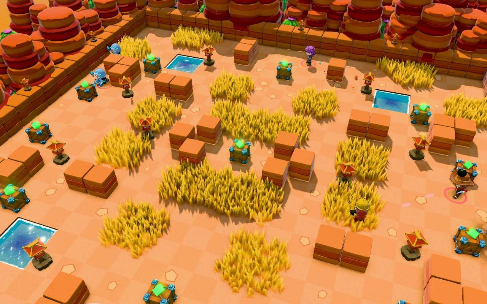<br><b>Oasis</b> · clear skies, water pools</td>
    <td width="50%">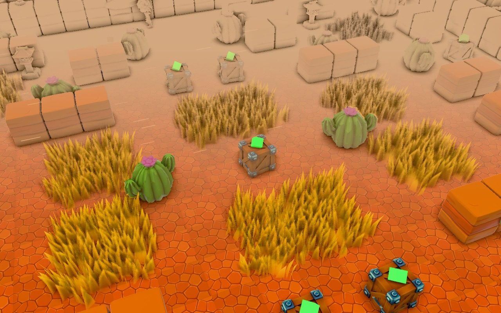<br><b>Dune Storm</b> · sandstorm</td>
  </tr>
  <tr>
    <td>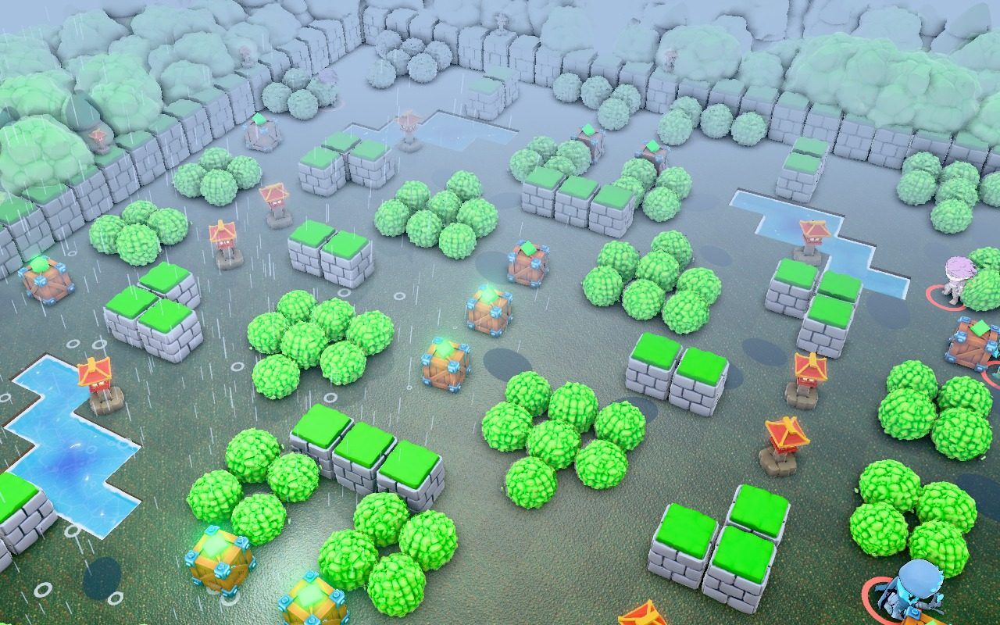<br><b>Rainy Grove</b> · rain and lightning</td>
    <td>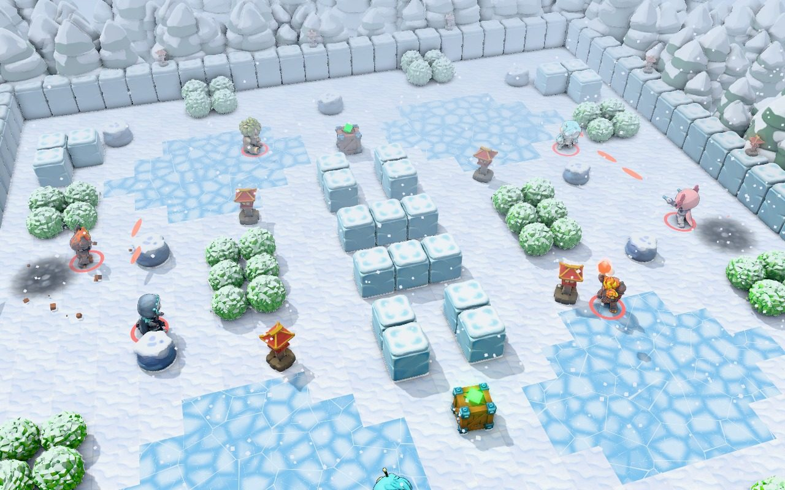<br><b>Frost Peak</b> · snow, slippery ice</td>
  </tr>
  <tr>
    <td>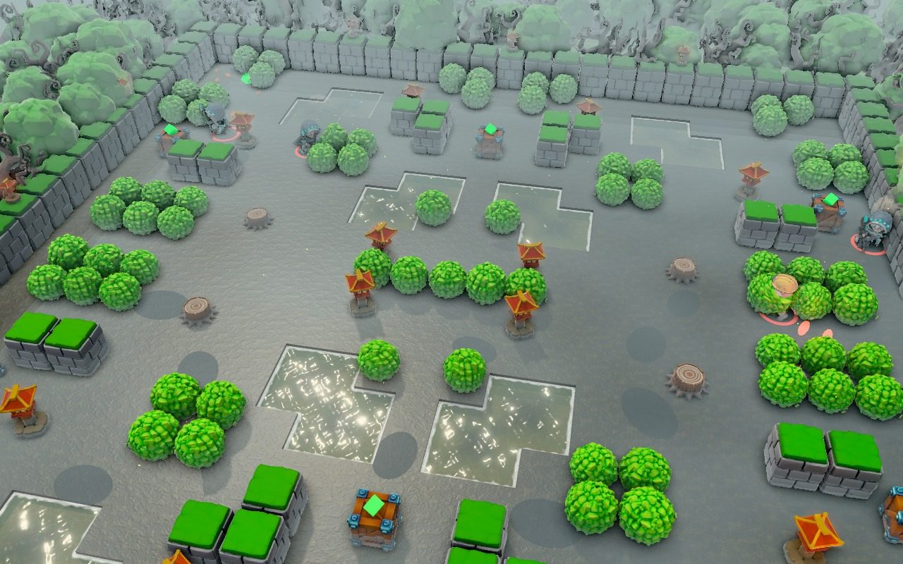<br><b>Misty Marsh</b> · fog that limits your vision</td>
    <td>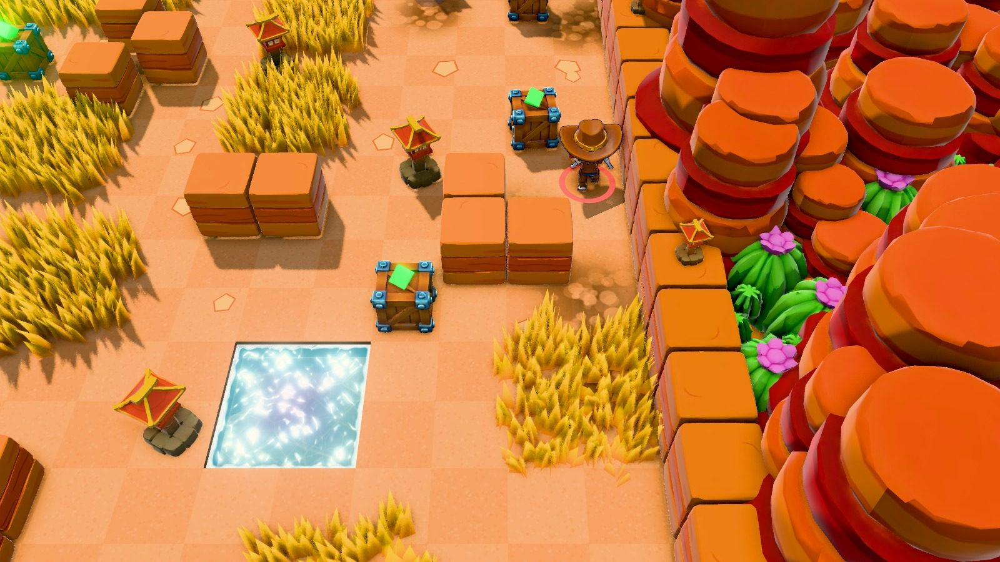<br><b>Showdown for 8</b> · one survivor</td>
  </tr>
</table>

## What's inside

### Real-time lighting and shadows

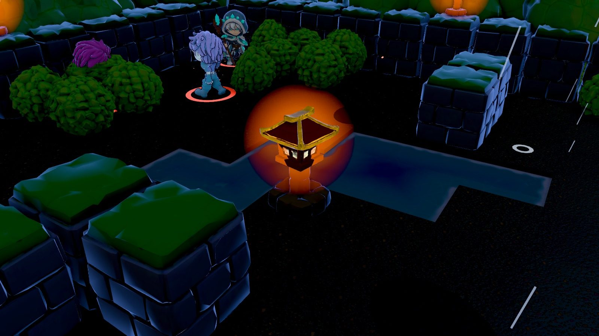

Soft shadows fitted to the camera, lanterns and projectiles that light up the scene, ambient occlusion and bloom.
The details are in [Lighting and shadow techniques](#lighting-and-shadow-techniques) below.

### Weather that changes the rules

<table>
  <tr>
    <td width="33%">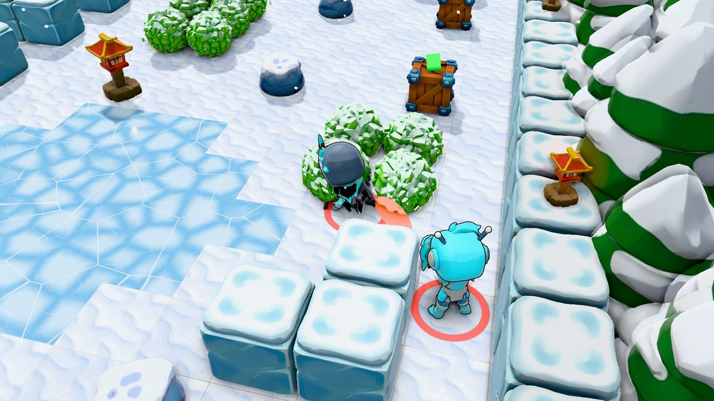</td>
    <td width="33%">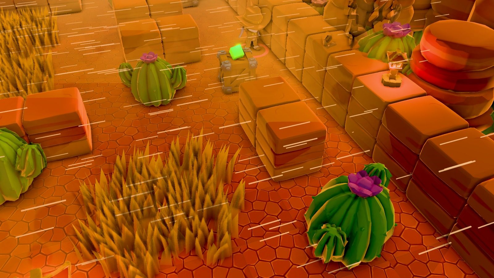</td>
    <td width="33%">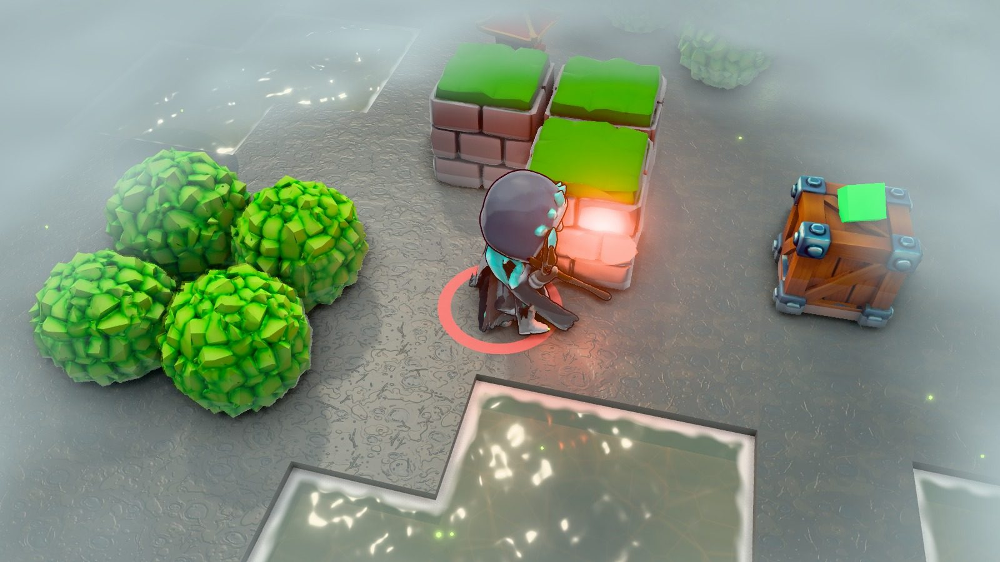</td>
  </tr>
</table>

Snow and slippery ice, sandstorms, rain and thunderstorms, and fog that shrinks your vision to a few meters.

### Day and night

<table>
  <tr>
    <td width="25%" align="center">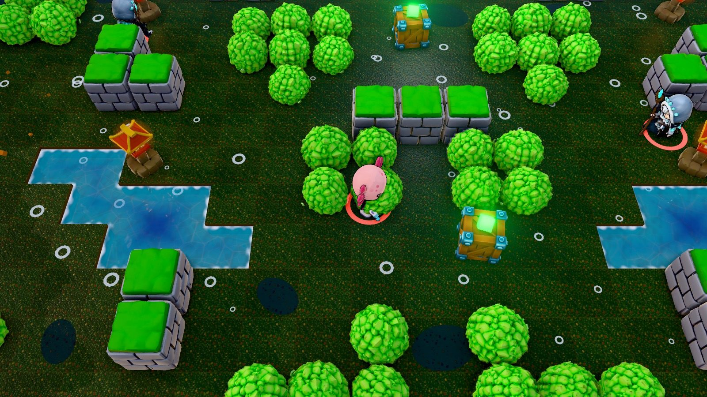<br><sub>Morning</sub></td>
    <td width="25%" align="center">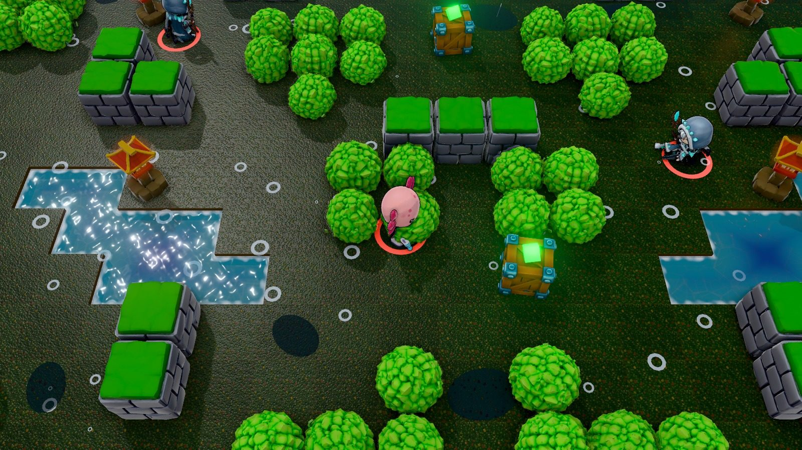<br><sub>Noon</sub></td>
    <td width="25%" align="center">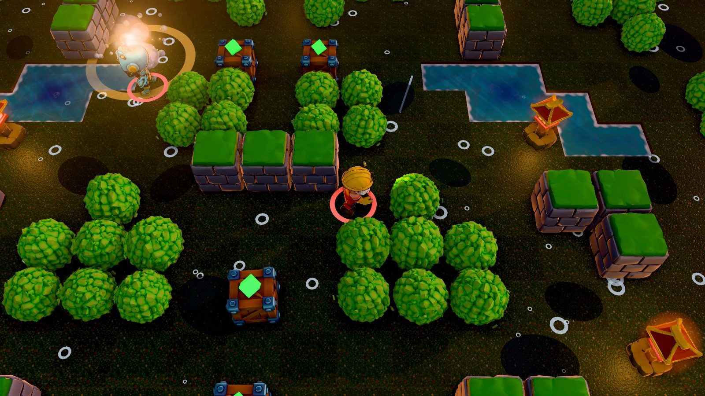<br><sub>Sunset</sub></td>
    <td width="25%" align="center">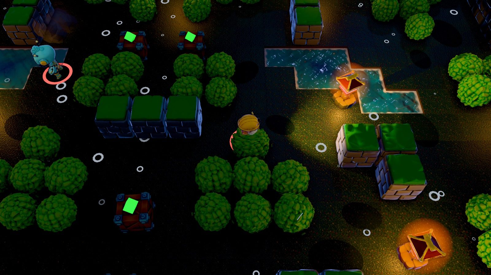<br><sub>Night</sub></td>
  </tr>
</table>

The same arena changes mood from one match to the next: the sun moves, lanterns light up at night and a head-lamp follows you after dusk.
Press <kbd>T</kbd> to skip to the next time of day.

### AI-made 3D figurines (and it shows)

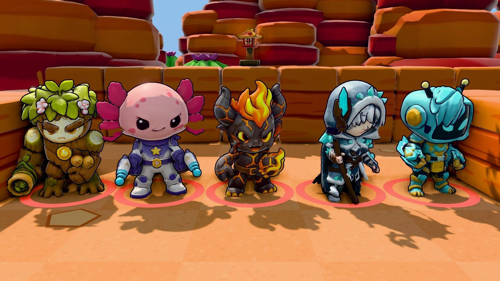

Characters and decor were modeled 100% locally from generated illustrations, so each figurine only cost its source image (about 4 cents).
The game rigs and animates them at load time: walking, aiming, recoil and breathing. Each brawler holds its own weapon, and it points where you shoot.

## Play

**[Play in your browser](https://ai-slop-arena.gtux-prog.workers.dev/play)**, or run it locally:

```bash
npm install
npm run dev          # site on http://localhost:5173, game on http://localhost:5173/play.html
npm run dev:server   # online server (Cloudflare Worker + Durable Objects, local), on :8787
npm run deploy       # build and deploy everything to Cloudflare
```

The home page (`index.html`, "/") is the showcase site with the trailer; the game itself is `play.html` ("/play"),
which opens on a loading screen while the models and textures stream in.

### Online play

**Find a match** puts every platform (web, Steam, Epic, Android, iOS) in one queue; after 5 minutes of
waiting, bots fill the empty slots. Room codes still work for playing with friends. Our server runs
every online match itself (the game rules built headless), validates every move, sends each player
only what they can see, and handles reports, kicks and bans: see [docs/moderation.md](docs/moderation.md).

### Desktop + Steam

The same game also runs as a desktop app (Electron) with Steam achievements, friend invites,
"Join game" from the friends list and Steam P2P multiplayer (no server needed). Cross-play rooms
let Steam and browser players meet, and the game is translated into all 30 Steam languages:

```bash
npm run desktop      # build and open the desktop app (start Steam first for the Steam features)
npm run dist:steam   # packaged Windows build in release/win-unpacked, ready for SteamPipe
```

See [steam/README.md](steam/README.md) for the achievements to declare and how to upload a build.

### Android, iOS and Epic Games Store

The same game ships as Android and iOS apps (Capacitor, with touch controls) and as an Epic Games
Store build. Every tagged version is built by GitHub Actions and attached to a
[GitHub release](https://github.com/gtko/ai-slop-arena/releases). Details: [docs/platforms.md](docs/platforms.md).

## Controls

| Input | Action |
| --- | --- |
| <kbd>W</kbd> <kbd>A</kbd> <kbd>S</kbd> <kbd>D</kbd> / arrows | Move |
| Mouse | Aim |
| Hold left mouse | Attack (3 ammo, auto-reloads) |
| Right mouse (hold to preview, release to fire) / <kbd>Space</kbd> / <kbd>E</kbd> | Super, once the ring is full |
| <kbd>T</kbd> | Next time of day |
| <kbd>Tab</kbd> | Toggle the Lighting and Shadows panel |
| <kbd>M</kbd> | Mute / unmute (the speaker button top-left opens the sound menu) |
| <kbd>Esc</kbd> | Menu; closes the result screen while spectating an online match |
| Gamepad | Left stick to move, right stick to aim, <kbd>RT</kbd> to attack, <kbd>LT</kbd> (hold and release) or <kbd>RB</kbd> for the super, <kbd>Y</kbd> for the time of day |

Keys can be rebound in the options menu, which also has the graphics presets (low to ultra) and the audio mix.

## Under the hood

### Stack

three.js (WebGL) · JavaScript · Vite · Cloudflare Workers and Durable Objects · Hunyuan3D-2 (local, AMD GPU via ROCm) ·
Gemini 2.5 Flash Image and Lyria 3 via OpenRouter · ElevenLabs · ffmpeg · Claude Code Desktop with Claude Opus 5.5

### Lighting and shadow techniques

- **Camera-fitted, texel-snapped sun shadows.** The orthographic shadow frustum follows the view instead of covering
  the whole map, which gives about 2 cm texels at 2048² instead of about 4 cm. Its origin snaps to whole shadow-map
  texels in light space, so edges don't shimmer while the camera moves. Both options can be toggled in the panel to compare.
- **Selectable filtering:** PCF (hardware 2×2 compare with 5 Vogel-disk taps rotated by interleaved gradient noise), VSM, or hard shadows, plus a softness slider.
- **Animated time of day.** Four keyframes (morning, noon, sunset, night) are interpolated in linear space: sun colour,
  intensity, elevation and azimuth, sky/ground hemisphere, IBL intensity, fog, exposure, bloom and rim light.
  The sun arcs across the far side of the arena, so shadows always fall toward the camera where you can see them.
- **Pooled dynamic point lights.** There are 12 fixed `PointLight`s (a fixed count, so shaders never recompile). Each frame they are
  handed to the most relevant emitters, scored by brightness and distance to the camera: projectiles, muzzle flashes,
  explosions, torches, glowing crates, power cubes and the poison wall. Lights fade out with distance before they could lose their slot, so there's no popping.
- **Shadow-casting head-lamp.** A spot light follows whoever the camera tracks and fades in after dusk. Walls and bushes
  throw long moving shadows ahead of you. Its shadow pass is skipped entirely in daylight.
- **Swaying foliage shadows.** Wind sway and "push-away" from nearby brawlers happen in world space in *both* the colour
  shader and a matching custom depth material, so bush and tree shadows move with the leaves.
- **Dithered bush reveal.** When you hide in a bush, the leaves around you dissolve with a 4×4 Bayer screen-door pattern.
  The pass stays opaque, so there are no transparency sorting problems, and the bush keeps casting its full shadow.
- **GTAO** ambient occlusion for contact shadows. Particles, decals and gas are excluded from its depth/normal pre-pass.
- **HDR pipeline:** half-float MSAA target → GTAO → Unreal bloom (emissive projectiles, fire and gems exceed 1.0) → ACES tone mapping.
- **Fresnel rim light** on characters, tinted per time of day, so brawlers stay readable in shade and at night.
- Baked vertex-colour gradients on walls, a PMREM room environment for speculars, a water shader with scrolling
  normals and shoreline foam, scorch decals, and shadow-casting debris.

Weather is a per-frame modifier on top of the time of day (sun, sky, fog distance, shadow softness,
exposure). It dims at night, so a foggy or rainy night stays dark. Storms also make the foliage sway harder.

### Multiplayer

`worker/index.js` is a Cloudflare Worker. It serves the built game as static assets and routes `/ws/<CODE>` to one
Durable Object per room, using the WebSocket Hibernation API. The room is a relay:

- The first player in the room is the **host**. Their browser runs the full simulation: bots, damage, walls,
  crates, cubes and gas. It broadcasts 15 Hz snapshots and events (attacks, hits, knockouts...).
- Other players send their input and position at 20 Hz. Movement is client-authoritative, which keeps it smooth,
  and everything else is decided by the host.
- If the host leaves, the next player is promoted and the running match is cancelled. A client who leaves mid-match
  is replaced by a bot.

Create a room from **Multiplayer**, then share the code or the invite link (`?room=CODE`).

### Generated assets

Everything under `public/assets/` was generated, and the game falls back to procedural art or synth sounds if any file is missing.

- `tex/`: seamless painted textures (sand, brick, stone, wood, grass) from Gemini 2.5 Flash Image,
  prompted as flat albedo with no baked lighting so the dynamic lights do the shading. Each `*_n.png` is a
  tileable normal map derived from it, so torches, projectiles and the head-lamp pick up the brick and plank relief.
- `ui/`: brawler portraits for the menu cards, action poses with the background removed (`art-src/ai3d/cutout.py`).
- `models/`: the brawler figurines and `models/decor/` the 15 decor props, generated on this machine's GPU from
  style-matched reference art (Hunyuan3D-2 shape + paint, see `art-src/ai3d/README.md`), then budgeted with
  `art-src/optimize_models.py`. The figurines are rigged at load time (`src/figurines.js`).
- `music/`: lobby, battle, victory and one theme per arena from Lyria 3 (`art-src/gen_music.py`), plus ElevenLabs day/night and weather ambience loops.
- `sfx/`: ElevenLabs sound effects (`art-src/gen_audio.py`).
- `site/`: the trailer and screenshots, recorded from the engine by the dev-only `src/trailer.js`.

Regenerate or reprocess them with the scripts in `art-src/` (raw sources are kept there):

```bash
python art-src/gen_audio.py        # skips files that already exist
python art-src/gen_music.py
python art-src/process_images.py   # resize, normal maps, portrait cut-outs
```

### Layout

```
src/
  main.js       renderer, post-processing chain, UI wiring, main loop
  lighting.js   sun/moon, hemisphere, IBL, head-lamp, time-of-day presets, shadow fitting
  materials.js  shader patches (rim, foliage sway + dither, water) and procedural textures
  arena.js      map layout, instanced walls/bushes/water, crates, torches, collision and line-of-sight
  effects.js    LightPool + instanced particles, flashes, shockwaves, scorch decals
  brawler.js    brawler types, movement and animation (figurine walk / aim, procedural rig fallback)
  figurines.js  GLB figurines: auto-rig (joint fit, arm cutting, skin weights), weapon axes, materials
  props.js      decor GLBs (walls, trees, rocks, crates, bushes, lanterns), instancing helpers
  combat.js     bullets, bursts, lobbed bombs, explosions
  ai.js         A* pathfinding and bot behaviour
  poison.js     shrinking gas
  game.js       match flow, damage, items, visibility, camera
  hud.js        overhead bars, floaters, HUD
  menu.js       video-game style menus: options, key bindings, gamepad navigation
  assets.js     texture loading (shared GPU images, per-use repeat)
  audio.js      sampled SFX, music crossfades, day/night + weather ambience, mix settings (synth fallback)
  maps.js       the five map layouts and their themes
  weather.js    rain + lightning, snow, sandstorm, fog + fireflies
  water.js      water basins (clear / swamp) and the ice field
  foliage.js    bushes, trees, pines, cacti, dead trees, obstacles
  lantern.js    lantern model (procedural, or the sculpted prop with glowing windows)
  net.js        WebSocket client for the rooms
  devtools.js   dev-only console helpers (manual stepping, poses, weight view, frame capture)
  trailer.js    dev-only trailer and screenshot recording
  site/         landing page script + styles (trailer, cards, reveals, prompt list)
worker/
  index.js      Cloudflare Worker + Room Durable Object (multiplayer relay)
art-src/        asset generation scripts and raw sources (ai3d/ = local image-to-3D pipeline)
docs/readme/    logo and animated trailer for this README
```
