<p align="center">
  
</p>

<p align="center">
  <b>A cute top-down 3D brawler that runs in your browser.</b><br>
  Brawl Stars–style Showdown in Godot 4 · real-time lighting and shadows · 5 arenas with live weather · online multiplayer
</p>

<p align="center">
  <a href="https://ai-slop-arena.gtux-prog.workers.dev/play"></a>
  <a href="https://ai-slop-arena.gtux-prog.workers.dev/"></a>
</p>

<p align="center">
  <a href="https://ai-slop-arena.gtux-prog.workers.dev/assets/site/trailer.mp4">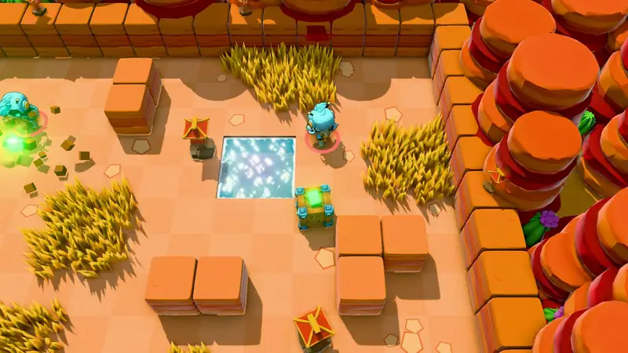</a><br>
  <sub>Real gameplay, recorded straight from the engine. <a href="https://ai-slop-arena.gtux-prog.workers.dev/assets/site/trailer.mp4">Watch the full trailer (25 s, MP4)</a></sub>
</p>

Pick a brawler, hide in the tall grass, smash crates for power cubes and be the last one standing while the poison gas closes in.
Eight players per match: play solo against bots, or create a room and share the link with friends (bots fill the empty slots).
No install, no account: it runs in any modern browser, with mouse and keyboard, touch or a gamepad.

## Made by an AI in two evenings

AI SLOP ARENA was built in **two evenings**, on September 22 and 23, 2026, after the kids went to bed: from 9 pm to midnight,
twice in a row, while watching *Frieren*. So my involvement was very moderate.

**Claude Opus 5.5**, running in **Claude Code Desktop in full-auto mode**, had all the ideas: it wrote the code, generated the assets,
played the game in a browser to test it and fixed whatever was wrong. I only prompted and supervised: 35 prompts between two episodes,
and saying "that's ugly" when it was ugly. The name is an honest nod: **everything** here was made by AI.

| 2 | 35 | ≈ 7,800 | 20 | $2.61 |
| :---: | :---: | :---: | :---: | :---: |
| evenings | prompts | lines of JavaScript | 3D models generated locally | spent on assets |

| Assets | Made with | Cost |
| --- | --- | ---: |
| Illustrations and textures | Nano Banana (Gemini 2.5 Flash Image) via OpenRouter | $2.21 |
| Music | Lyria 3 Pro and Clip via OpenRouter | $0.40 |
| Sound effects and ambiences | ElevenLabs (2,500 credits) | ≈ $0 |
| 3D figurines and decor | Hunyuan3D-2, 100% local on the GPU (AMD, ROCm) | $0 |
| **Total** | | **$2.61** |

Every prompt, with its timestamp, is listed on the [website](https://ai-slop-arena.gtux-prog.workers.dev/#apropos) (in French).

## The brawlers

<table>
  <tr>
    <td align="center" valign="bottom" width="20%">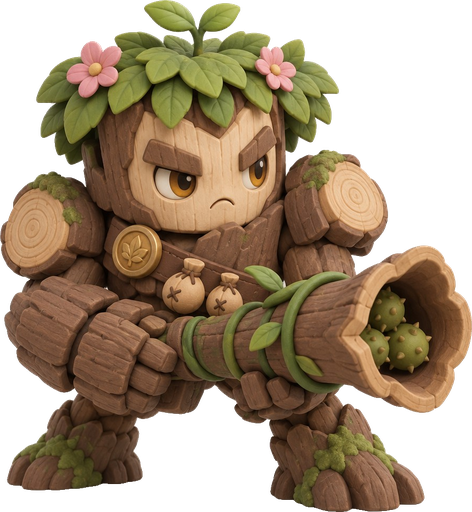<br><b>Blaster</b><br><sub>Shotgun</sub></td>
    <td align="center" valign="bottom" width="20%">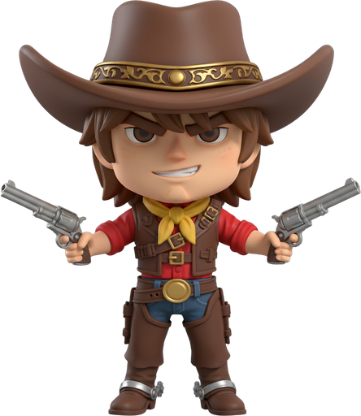<br><b>Gunslinger</b><br><sub>Sharpshooter</sub></td>
    <td align="center" valign="bottom" width="20%">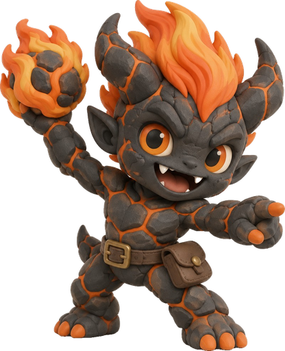<br><b>Bomber</b><br><sub>Thrower</sub></td>
    <td align="center" valign="bottom" width="20%">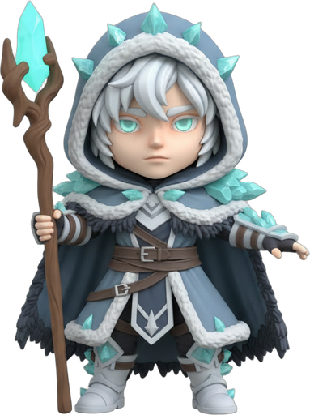<br><b>Frostbite</b><br><sub>Ice mage</sub></td>
    <td align="center" valign="bottom" width="20%">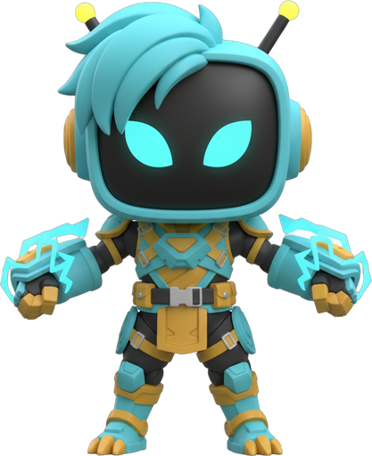<br><b>Volt</b><br><sub>Electric robot</sub></td>
  </tr>
</table>

- **Blaster**: a tree-stump golem whose log blunderbuss sprays five thorny seeds at short range. Super: a blast that knocks enemies back and smashes walls.
- **Gunslinger**: an axolotl star-ranger whose twin ray pistols fire a long-range six-bolt burst. Super: a twelve-bolt volley that goes through walls.
- **Bomber**: a magma imp who lobs fireballs over cover. Super: a meteor that levels everything around it.
- **Frostbite**: three ice shards that slow. Super: a frost nova that freezes everyone nearby.
- **Volt**: an orb whose lightning chains to two enemies. Super: a storm that calls down lightning.

## Five arenas, five weathers

<table>
  <tr>
    <td width="50%">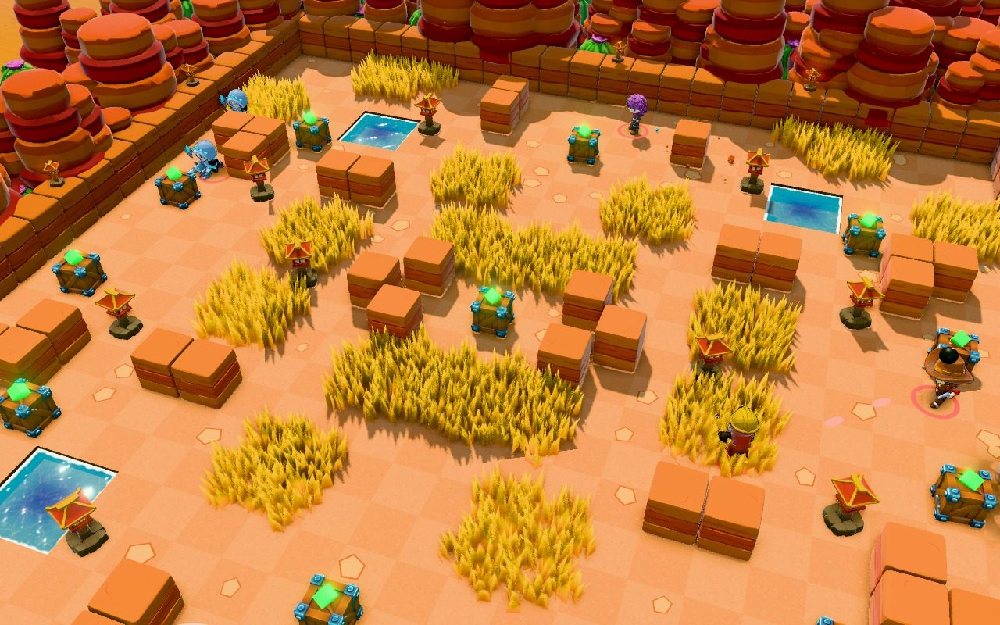<br><b>Oasis</b> · clear skies, water pools</td>
    <td width="50%">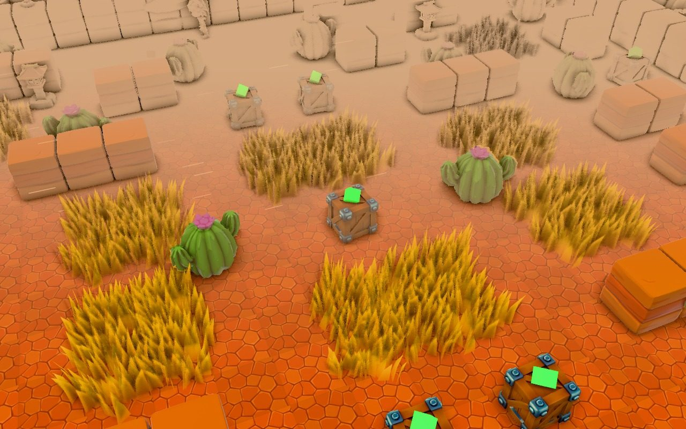<br><b>Dune Storm</b> · sandstorm</td>
  </tr>
  <tr>
    <td>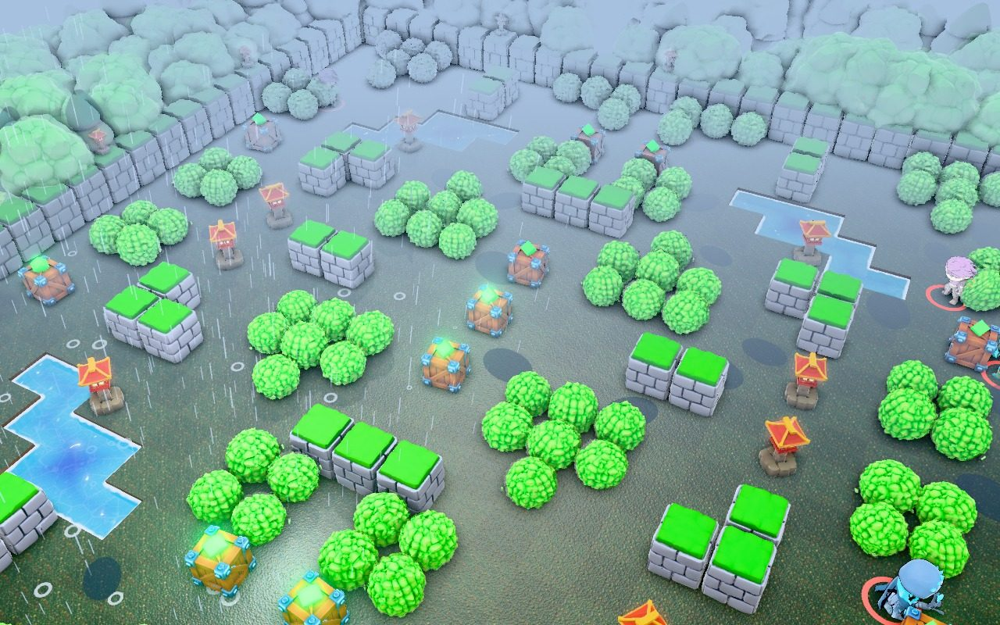<br><b>Rainy Grove</b> · rain and lightning</td>
    <td>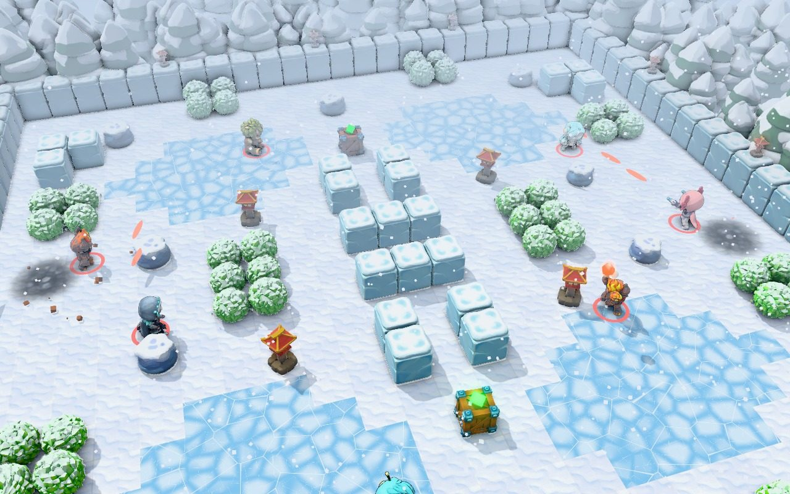<br><b>Frost Peak</b> · snow, slippery ice</td>
  </tr>
  <tr>
    <td>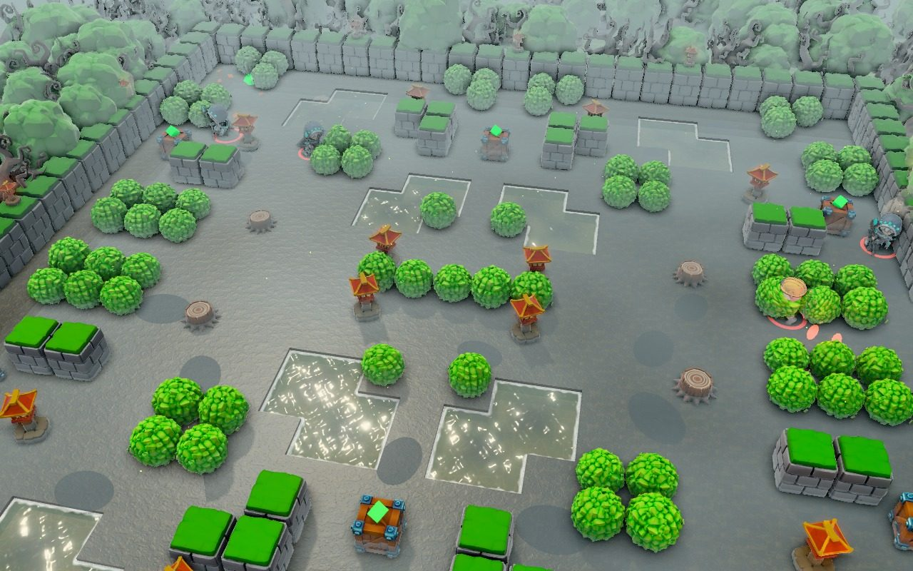<br><b>Misty Marsh</b> · fog that limits your vision</td>
    <td>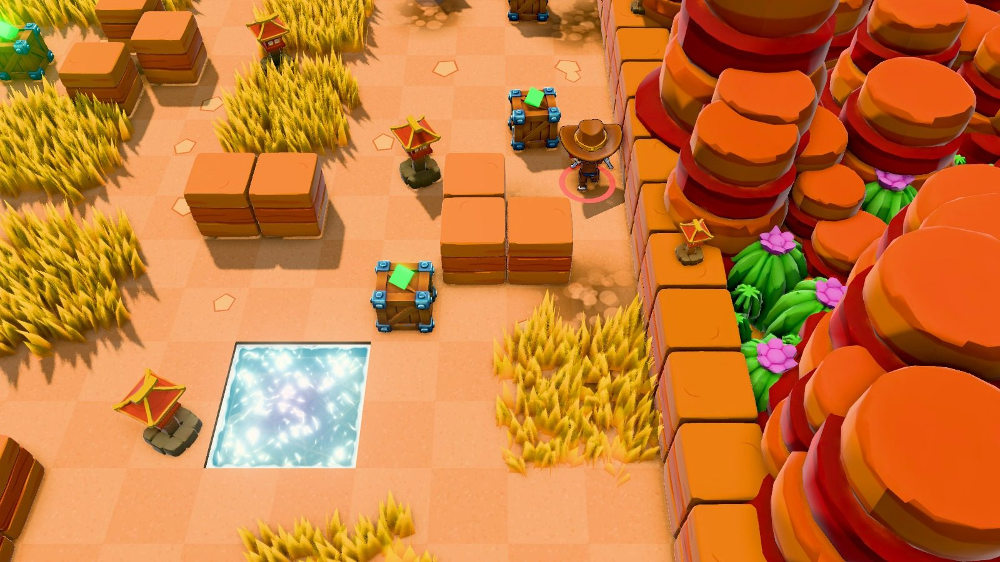<br><b>Showdown for 8</b> · one survivor</td>
  </tr>
</table>

## What's inside

### Real-time lighting and shadows

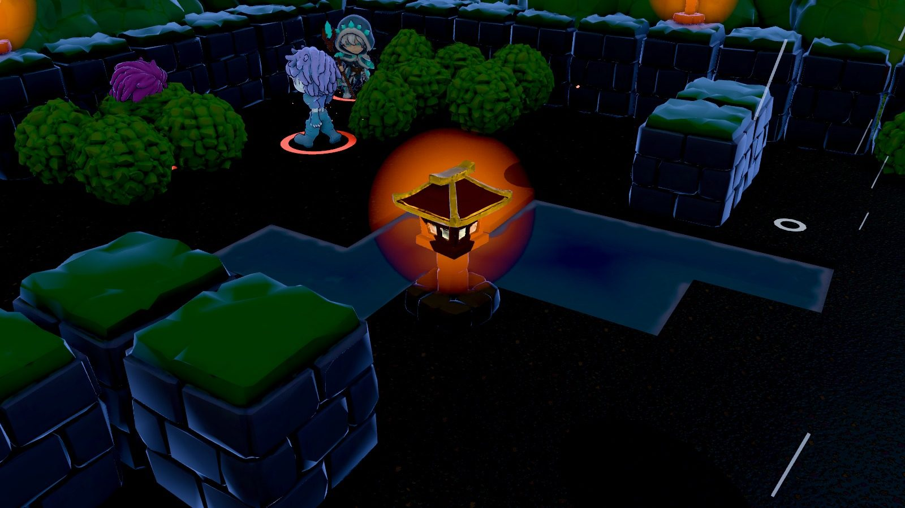

Soft shadows fitted to the camera, lanterns and projectiles that light up the scene, ambient occlusion and bloom.
The details are in [Lighting and shadow techniques](#lighting-and-shadow-techniques) below.

### Weather that changes the rules

<table>
  <tr>
    <td width="33%">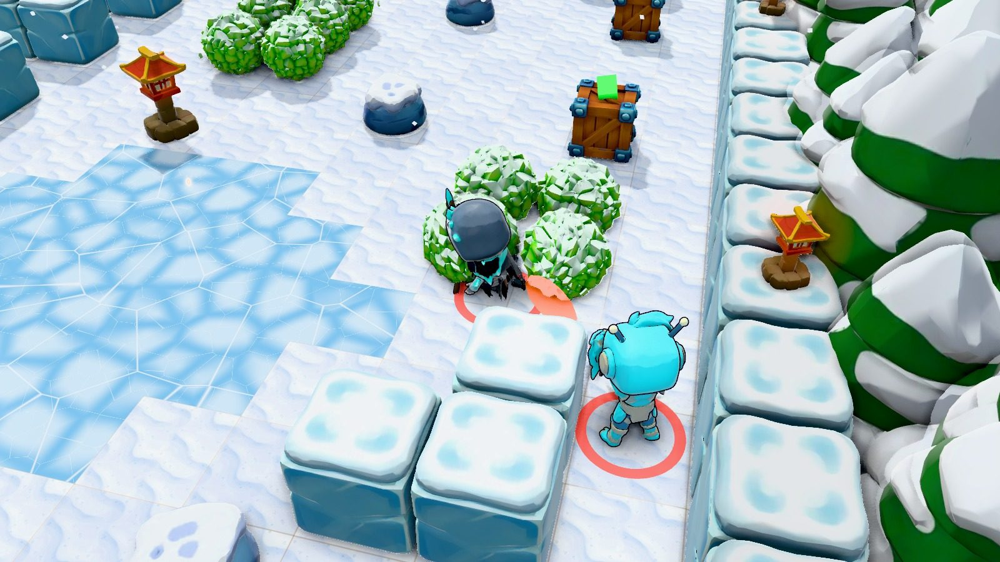</td>
    <td width="33%">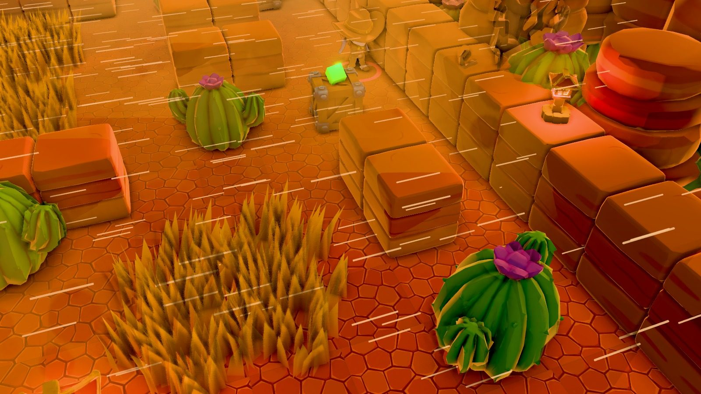</td>
    <td width="33%">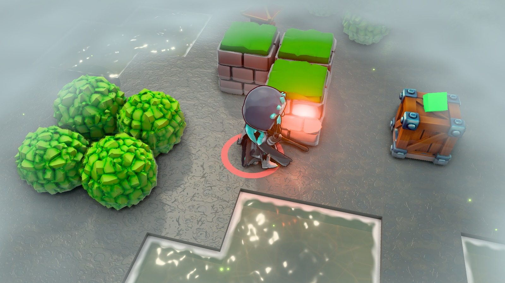</td>
  </tr>
</table>

Snow and slippery ice, sandstorms, rain and thunderstorms, and fog that shrinks your vision to a few meters.

### Day and night

<table>
  <tr>
    <td width="25%" align="center">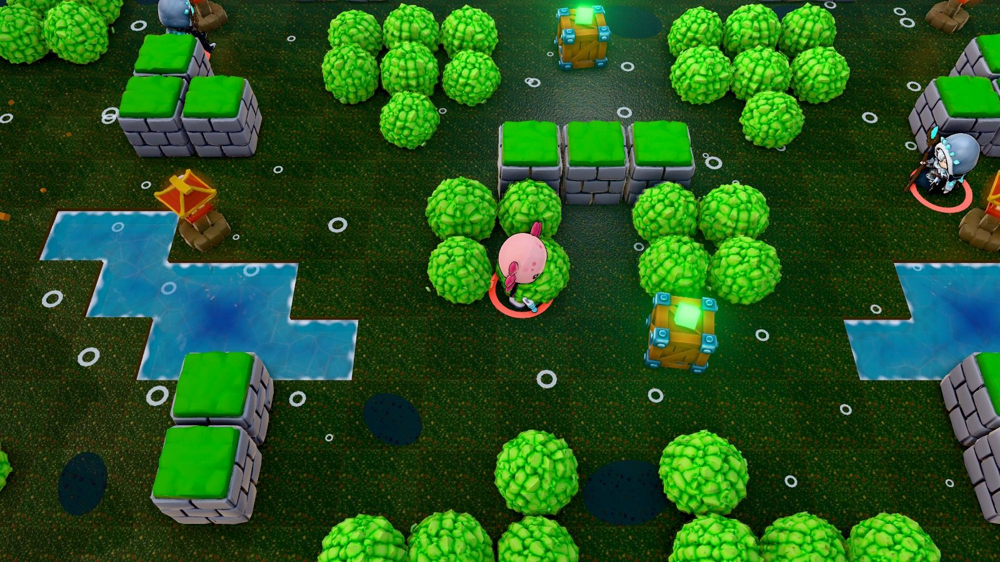<br><sub>Morning</sub></td>
    <td width="25%" align="center">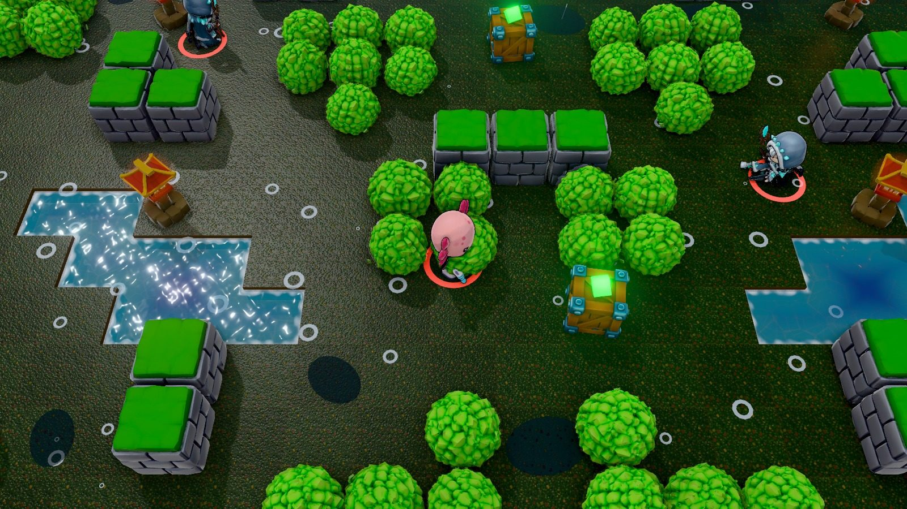<br><sub>Noon</sub></td>
    <td width="25%" align="center">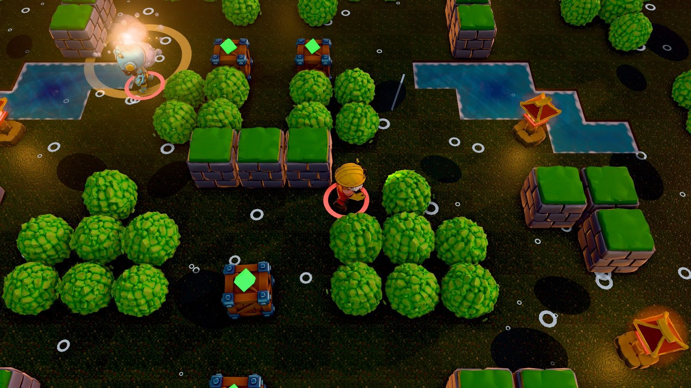<br><sub>Sunset</sub></td>
    <td width="25%" align="center">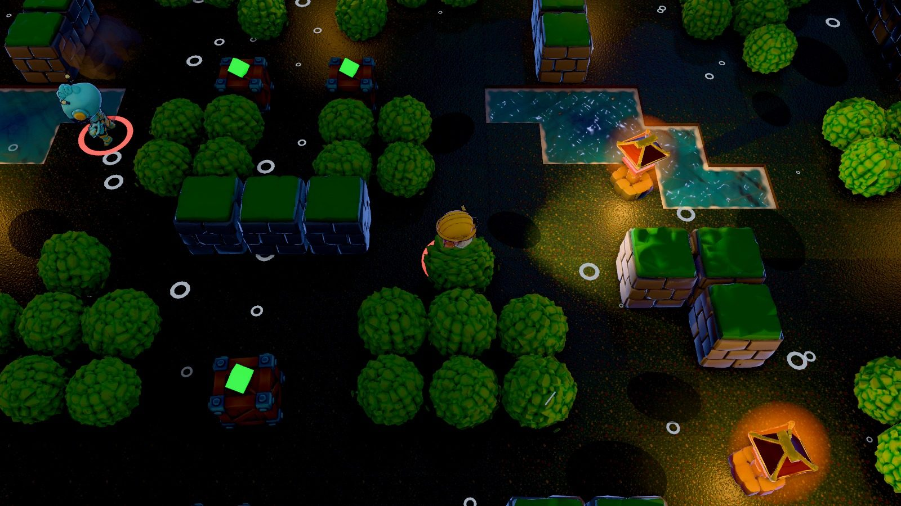<br><sub>Night</sub></td>
  </tr>
</table>

The same arena changes mood from one match to the next: the sun moves, lanterns light up at night and a head-lamp follows you after dusk.
Press <kbd>T</kbd> to skip to the next time of day.

### AI-made 3D figurines (and it shows)

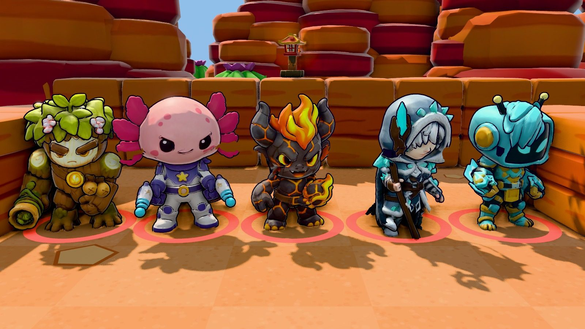

Characters and decor were modeled 100% locally from generated illustrations, so each figurine only cost its source image (about 4 cents).
The game rigs and animates them at load time: walking, aiming, recoil and breathing. Each brawler holds its own weapon, and it points where you shoot.

## Play

**[Play in your browser](https://ai-slop-arena.gtux-prog.workers.dev/play)**. The game client is the
Godot 4 project in `godot/` (web, Windows, Linux, Android, iOS); the server and the website live here:

```bash
npm install
npm test                 # the server's game rules headless, ranking, the 30 locales
npm run dev              # the website on http://localhost:5173
npm run dev:server       # site + online server (Cloudflare Worker + Durable Objects, local) on :8787
npm run deploy:godot-web -- --local   # export the Godot web client into the local R2: /play works on :8787
npm run deploy           # build and deploy the website and the server to Cloudflare
```

The home page (`index.html`, "/") is the showcase site with the trailer; the game is at "/play", which
redirects to the Godot web client (`/godot/<version>/`, served from R2). Run the client natively with
`godot --path godot` (see [godot/README.md](godot/README.md)).

### Online play

**Find a match** puts every platform (web, Steam, Epic, Android, iOS) in one queue; after 1 minute of
waiting, bots fill the empty slots. Room codes still work for playing with friends, and an invite link
(`/play?room=CODE`) opens the game straight in that room. Our server runs every online match itself
(the game rules built headless), validates every move, sends each player only what they can see, and
handles reports, kicks and bans: see [docs/moderation.md](docs/moderation.md).

### Steam, Epic, Android and iOS

The same Godot client is exported for Steam (Windows, Linux), the Epic Games Store, Android and iOS.
Every tagged version is built by GitHub Actions and attached to a
[GitHub release](https://github.com/gtko/ai-slop-arena/releases). Details: [docs/platforms.md](docs/platforms.md);
Steam: [steam/README.md](steam/README.md).

## Controls

| Input | Action |
| --- | --- |
| <kbd>W</kbd> <kbd>A</kbd> <kbd>S</kbd> <kbd>D</kbd> / arrows | Move |
| Mouse | Aim |
| Hold left mouse | Attack (3 ammo, auto-reloads) |
| Right mouse (hold to preview, release to fire) / <kbd>Space</kbd> / <kbd>E</kbd> | Super, once the ring is full |
| <kbd>T</kbd> | Next time of day |
| <kbd>Tab</kbd> | Toggle the Lighting and Shadows panel |
| <kbd>M</kbd> | Mute / unmute (the speaker button top-left opens the sound menu) |
| <kbd>Esc</kbd> | Menu; closes the result screen while spectating an online match |
| Gamepad | Left stick to move, right stick to aim, <kbd>RT</kbd> to attack, <kbd>LT</kbd> (hold and release) or <kbd>RB</kbd> for the super, <kbd>Y</kbd> for the time of day |

Keys can be rebound in the options menu, which also has the graphics presets (low to ultra) and the audio mix.

## Under the hood

### Stack

Godot 4 (GDScript) · JavaScript · Vite · Cloudflare Workers and Durable Objects · Hunyuan3D-2 (local, AMD GPU via ROCm) ·
Gemini 2.5 Flash Image and Lyria 3 via OpenRouter · ElevenLabs · ffmpeg · Claude Code Desktop with Claude Opus 5.5

### The client

The Godot client (`godot/`) renders the server's snapshots and sends inputs; the rules run on the
server only. Its lighting, weather, foliage, water and toon shading are ports of the first client
(three.js, retired in v0.18): see [godot/README.md](godot/README.md) and
[docs/godot-migration.md](docs/godot-migration.md).

### Multiplayer

`worker/index.js` is a Cloudflare Worker. It serves the website as static assets, the Godot web
client from R2 (`/godot/`), and routes `/ws/<CODE>` to one Durable Object per room, using the
WebSocket Hibernation API. The room **runs the match**: `src/server/sim.js` bundles the shared game
rules (`src/game.js` and its graph, built headless by `vite build --mode server`). Players only send
their inputs; the room validates them and sends each player what they can see. `/mm` is the global
matchmaking queue.

### Generated assets

Everything under `public/assets/` was generated. The Godot client imports the models and sounds from there (`godot/tools/convert-models.mjs`, `convert-audio.mjs`); the website uses the portraits, screenshots and the trailer.

- `tex/`: seamless painted textures (sand, brick, stone, wood, grass) from Gemini 2.5 Flash Image,
  prompted as flat albedo with no baked lighting so the dynamic lights do the shading. Each `*_n.png` is a
  tileable normal map derived from it, so torches, projectiles and the head-lamp pick up the brick and plank relief.
- `ui/`: brawler portraits for the menu cards, action poses with the background removed (`art-src/ai3d/cutout.py`).
- `models/`: the brawler figurines and `models/decor/` the 15 decor props, generated on this machine's GPU from
  style-matched reference art (Hunyuan3D-2 shape + paint, see `art-src/ai3d/README.md`), then budgeted with
  `art-src/optimize_models.py`.
- `music/`: lobby, battle, victory and one theme per arena from Lyria 3 (`art-src/gen_music.py`), plus ElevenLabs day/night and weather ambience loops.
- `sfx/`: ElevenLabs sound effects (`art-src/gen_audio.py`).
- `site/`: the trailer and screenshots, recorded from the first (three.js) client.

Regenerate or reprocess them with the scripts in `art-src/` (raw sources are kept there):

```bash
python art-src/gen_audio.py        # skips files that already exist
python art-src/gen_music.py
python art-src/process_images.py   # resize, normal maps, portrait cut-outs
```

### Layout

```
godot/          the game client (Godot 4.4): scripts/, scenes, data exported from src/, export presets
src/
  game.js ...   the shared game rules the server runs (game, ai, arena, brawler, combat, maps, ...)
  server/       the headless server bundle entry (sim.js) and its stubs
  economy.js    profile economy constants (exported to the Godot client)
  cosmetics.js  skins, trails, emotes, shop prices
  i18n/         English strings, the 29 other locales, the language list
  updates.js    the old Capacitor apps' frozen update manifest
  site/         landing page and roadmap script + styles
worker/
  index.js      Cloudflare Worker: rooms (Durable Objects), matchmaking, ranking, moderation, /play
  godot-web.js  the Godot web client from R2 (/godot/<version>/)
art-src/        asset generation scripts and raw sources (ai3d/ = local image-to-3D pipeline)
docs/readme/    logo and animated trailer for this README
```
