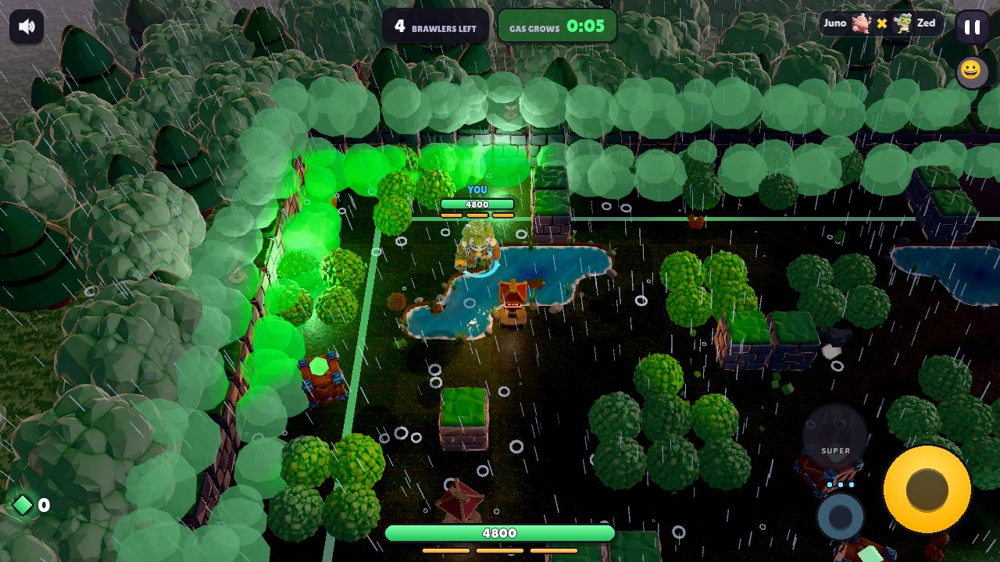
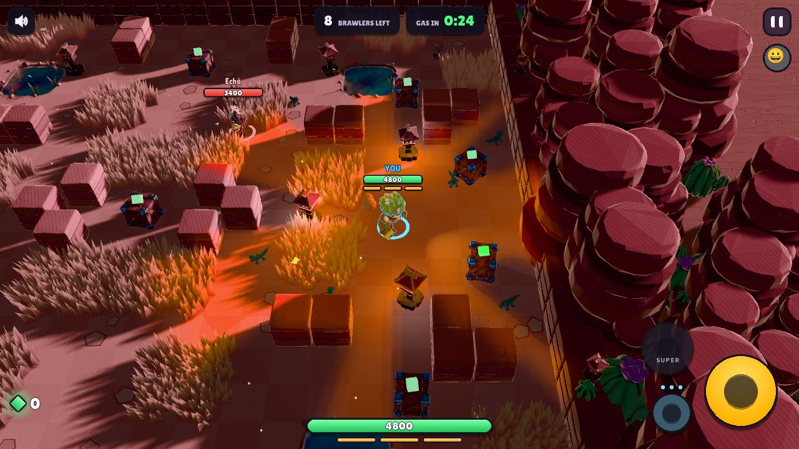
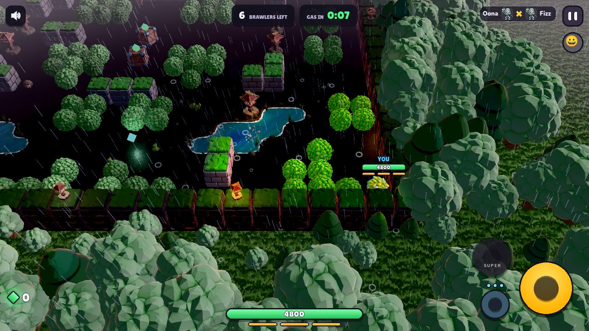

# Local simulation (D1 spike): offline solo and dojo in the Godot client

Decision D1 (`docs/godot-migration.md`): keep offline play by running the server's own rules inside the
Godot client. This spike (branch `claude/local-sim-spike`) answers whether that holds up, on web and
native, and what it costs to finish.

**Verdict: go**, with two optimizations required before phones (match setup time, low-end CPUs) and the
native builds for Linux/Android/iOS still to be produced in CI.

## How it works

```
src/game.js ... src/server/sim.js (ServerMatch) ── src/server/local.js (LocalRoom, SlopLocal API)
        └── npx vite build --mode localsim ──> godot/local/sim_local.js  (one classic script, 486 kB, 150 kB gzip)
                                                 │ exported in the .pck (include_filter local/*.js)
godot/scripts/local_room.gd  (class LocalRoom extends NetClient)
   web:    JavaScriptBridge.eval(bundle) → window.SlopLocal, polled every frame on the main thread
   native: QuickJSVM GDExtension (godot/addons/quickjs, source native/quickjs), on its own Thread
main.gd: `net` = the room socket (NetClient) or the LocalRoom; the message handling is unchanged
```

- **Same protocol.** `src/server/local.js` re-implements the room of `worker/index.js` for one human:
  `welcome`, `room`, `start`, `lprog`, `go` (3-2-1), then the `snap`/`ev` that `Game` already produces in
  the host role, `room {inMatch:false}` at the end, `pong`. It accepts `in`, `pick`, `map`, `mode`,
  `chaos`, `start`, `lprog`, `loaded`, `ping` (+ `dojo`). No timers or I/O: the host calls
  `SlopLocal.open(json) / send(id, json) / poll(id, seconds) → json / close(id)`. Only JSON strings cross
  the engine boundary, so the web and native backends share one API.
- **main.gd changes are small** (about 40 lines): two clients (`online`, `offline`), `net` points at one,
  `_open_room(code, matchmade, local, dojo)`. TRAINING opens the dojo locally; SOLO goes local with
  `--local` (web `?local`), or automatically when the server never answers (the socket closes before
  `welcome`). Quick play and private rooms stay online.
- **Dojo offline**: `Game.newMatch({dojo})` now works headless (the training hero is the human brawler,
  `game.dojoHero`, instead of only the local player); `ServerMatch` takes `dojo`. The dummies stand in a
  row, heal after 2 s, the player cannot be hurt.
- **Native thread**: the VM lives on a `Thread`; inputs go in through a mutex-protected queue, message
  batches come out the same way. Building a match (5 s in QuickJS) never freezes the renderer.

## Measurements

Desktop: Ryzen 5 5600 (Zen 3), Windows 11. "CPU per simulated second" = time spent in `poll()` per second
of match (60 polls/s, fixed 1/60 s steps), 1 human + 7 bots, `oasis`, `scripts/local-sim-bench.js`
(`FULL`: the human cannot die, so the bots play a whole match, worst case).

| | V8 (node 25) | QuickJS-ng 0.17 (qjs.exe) | QuickJS-ng in Godot (GDExtension, MSVC) |
|---|---|---|---|
| Bundle eval | 8 ms | 4-9 ms | 95-168 ms (incl. file read) |
| Match setup (`start`) | 0.4-1.1 s | 4.1-5.6 s | 4.6-6.1 s (sim thread) |
| Full match, mean CPU / sim s | 50 ms | 56 ms | 42 ms |
| Busiest 10 s (8→5 alive, fights) | 190 ms/s | 176 ms/s | 101 ms/s |
| Poll p50 / p95 / p99 / max | 0.4 / 1.0 / 9 / 264 ms | 0.4 / 2.0 / 7 / 401 ms | 0.26 / 1.4 / 10 / 121 ms |
| Heap | — | — | 23-26 MB |
| Dojo, CPU / sim s | 7 ms | 40 ms | — |

In the running Godot client (incl. JSON hop, 600 last polls): native QuickJS mean 1.4 ms, p95 3.1 ms,
max 19 ms (on its thread); web (Chrome, V8, main thread) mean 0.7 ms, p95 2.6 ms, max 8 ms.

**Found and fixed on the way**: `Poison.update` animated the gas cloud instances on every step even
headless. Late in a match (rings full of gas) it took 85 % of the step: QuickJS went from 300-1900 ms
per simulated second to 25-40. The fix (`if (this.g.headless) return` after the rules part) also cuts the
Cloudflare server's CPU per match.

**Remaining hot spots** (QuickJS profile, `Brain`/`Combat`/`Arena` aside, which are the actual rules):
- Match setup: 70 % is `Brawler` → `buildModel` → `Rig.bake` (sculpted three.js meshes) and the arena
  meshes, built for nothing on a headless simulation. A headless stub model would bring setup from 5 s to
  well under 1.5 s on desktop QuickJS (and helps the server).
- `Brawler.animate` / `poseRig`: ~13 % of the step, cosmetic.

### Phone estimate (not measured on a device)

QuickJS is an interpreter (no JIT, so it is allowed on iOS). Single-thread interpreter speed relative to
the Zen 3 desktop: flagship big core (Cortex-X3/X4, Apple A16+) ~70-90 %, mid-range Cortex-A76/A78 ~40-50 %,
little Cortex-A55 ~12-15 %.

| Phone class | Mean CPU / sim s | Busiest 10 s | Match setup (today → with headless models) |
|---|---|---|---|
| Flagship | 50-70 ms (5-7 % of one core) | 120-250 ms | 6-8 s → ~1.5 s |
| Mid-range (A78) | 90-140 ms | 250-450 ms | 10-15 s → 2-3 s |
| Low-end (A55 only) | 300-450 ms | 0.7-1.5 s: falls behind real time in big fights | 35-45 s → 6-8 s |

It runs on its own thread, so the renderer keeps its frame budget; on low-end phones the simulation
would slow down (ServerMatch.advance caps the backlog at 0.25 s) rather than stutter. Mitigations if
needed: headless models (setup + 13 % of the step), 30 Hz rules on low-end (the server's `Game` is
stable at 1/60; would need checking), fewer bots in solo on low-end.

### Size added

| Platform | Engine | Added |
|---|---|---|
| All | bundle `local/sim_local.js` in the pack | 486 kB (150 kB compressed) |
| Web | browser JS (nothing) | 0 (the bundle only) |
| Windows x86_64 | `libquickjs.windows.template_release.x86_64.dll` (static CRT) | 1.4 MB, measured |
| Linux x86_64 | `.so` | ~1.2 MB (estimate) |
| Android arm64-v8a + armeabi-v7a | 2 × `.so` | ~1.0 + 0.8 MB (estimate) |
| iOS arm64 | static xcframework | ~1.2 MB (estimate) |

## Platform matrix

| Platform | Engine | Status in this spike |
|---|---|---|
| Web | browser V8/JSC/SpiderMonkey via JavaScriptBridge | **works**: offline match in Chrome, static server only (screenshot below) |
| Windows | QuickJSVM GDExtension | **works**: full offline match vs 7 bots and the dojo, no server running |
| Linux | QuickJSVM | not built (needs a Linux toolchain: CI `barichello/godot-ci`, gcc) |
| Android arm64 / armv7 | QuickJSVM (NDK clang) | not built, not tested; QuickJS-ng builds with the NDK (upstream CI) |
| iOS | QuickJSVM (static) | not built, not tested; interpreter only, App Store compliant |

QuickJS-ng is built from source (no binary dependency): CMake for every target, the same `native/quickjs`
project with the NDK toolchain file or `-DCMAKE_SYSTEM_NAME=iOS`. A platform without its library simply
has no `QuickJSVM` class: `LocalRoom.available()` is false and SOLO / TRAINING stay online.

## Alternatives considered

| Option | License | Why not |
|---|---|---|
| **QuickJS-ng + own 200-line GDExtension (chosen)** | MIT (QuickJS-ng), MIT (godot-cpp) | — |
| GodotJS (godotjs/GodotJS: V8, QuickJS, JSC, browser) | MIT | an engine *module*: a custom Godot build for every platform and every editor; far more than an `eval` |
| sttts/godot-quickjs | MIT (Bellard QuickJS) | 3 commits, no releases, Bellard's QuickJS (no MSVC); our own wrapper is the same size and lets us run it on a thread |
| Port the rules to GDScript | — | ~6k lines of rules (game, brawler, combat, ai, kit, events, arena...), two copies to keep in sync forever |
| Local node/deno process | — | impossible on Android/iOS |
| Server-side dojo, offline lost | — | the fallback of D1 |

Downloaded for the spike (official GitHub releases / tags only): `godot-cpp` tag `godot-4.4-stable` (MIT),
`quickjs-ng` tag `v0.17.0` source (MIT, license copied to `godot/addons/quickjs/LICENSE-quickjs-ng.txt`),
`qjs-windows-x86_64.exe` v0.17.0 (2.1 MB, benchmark only, not committed). Built with the local MSVC 14.50.

## Try it

```bash
npx vite build --mode localsim            # godot/local/sim_local.js (re-run after any rules change)
godot --path godot -- --local             # SOLO plays offline; TRAINING is always the local dojo
godot --path godot -- --autotest --local [--dojo] [--map=grove] [--secs=40] [--shot=x.png]
godot --headless --path godot --script res://tools/local_sim_bench.gd -- --full --maxt=120
cat godot/local/sim_local.js scripts/local-sim-bench.js > /tmp/b.js && node /tmp/b.js   # or qjs
# native library (Windows, from a VS developer prompt):
cmake -S native/quickjs -B build-qjs -G Ninja -DCMAKE_BUILD_TYPE=Release \
  -DGODOT_CPP_DIR=<godot-cpp> -DQUICKJS_DIR=<quickjs-ng> -DGODOTCPP_TARGET=template_release
cmake --build build-qjs
# web: export the "Web" preset (debug for ?local), serve godot/build/web, open index.html?local
```





## Risks

1. **Phone CPU** (estimates above): fine on mid-range and up, marginal on A55-only phones in big fights.
   Needs a real-device measurement (internal Play track) before shipping.
2. **Match setup time** in QuickJS (5 s desktop, 10-15 s mid-range) until the headless models land.
3. **Bundle drift**: `sim_local.js` must be rebuilt with every rules change and shipped with the client
   (it is in the pack, so a client always has a consistent copy; add it to `npm run build` / the
   release `prepare` job, and to the OTA PCK).
4. **Native builds in CI** for Linux, Android (2 ABIs), iOS: not done; build-system work, no code risk
   expected (QuickJS-ng is tested upstream on all of them).
5. **Offline rewards**: offline matches award coins / Bot League like the online SOLO (`_vs_bots`);
   the profile is already client-side, so no new exploit, but the economy should know.
6. Small things: the HUD shows a gas timer in the dojo (no gas there) and no DPS readout yet; `stats()`
   reads the poll timings without a lock (measurement only); no Web Worker on the web (0.7 ms/frame on
   the main thread is fine).

## Effort to finish

| Task | Effort |
|---|---|
| Headless brawler / arena models (setup ÷3-4, -13 % step, server benefits too) | M |
| CI: `vite build --mode localsim` in prepare; QuickJS builds for Linux, Android arm64+armv7, iOS; addon in the exports | M |
| Real-device measurements (one mid-range and one low-end Android, one iPhone) | S |
| SOLO UX: offline toggle / automatic fallback message, dojo HUD (no gas timer, DPS from `game.dojoDps` in the snapshots) | S |
| Tests: a `npm test` case that runs the local room bundle for a match in node, and one in QuickJS | S |
| Removing the three.js client's own offline path once Godot ships it | S |

Total: about 1 to 1.5 weeks.
