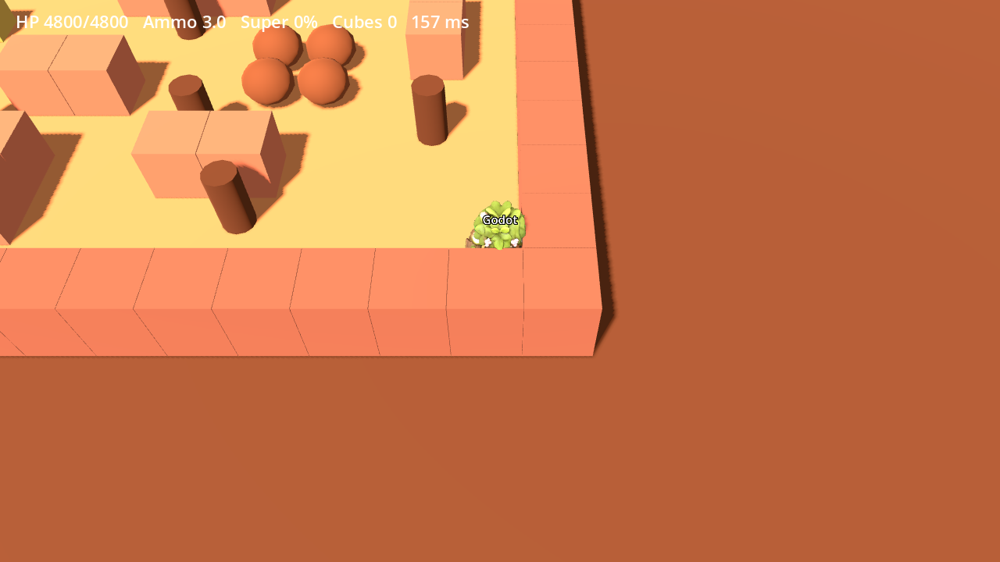

# AI SLOP ARENA, Godot 4 client (comparison branch)

A Godot 4.4 client for the **existing** game server. Nothing of the rules is ported: the Cloudflare
room (`worker/index.js`) runs every match with the same `Game` code as the web build, and this
client only renders snapshots and sends inputs (protocol v6, see `scripts/net_client.gd`). So the
Godot build and the three.js builds can play in the same room (cross-play).

## Run

```bash
node godot/tools/export-data.mjs       # maps.json + brawlers.json from src/ (re-run when maps/stats change)
cd godot/tools && npm i && node convert-models.mjs && cd ..   # meshopt GLBs -> plain GLBs for Godot
godot --path godot                      # desktop (Godot 4.4+)
```



Server: leave the default (production) or run `npm run dev:server` and type `ws://localhost:8787`.
Headless end-to-end check against a running server:

```bash
godot --headless --path godot -- --autotest ws://localhost:8787
```

## What is in

Everything is a client of the existing server (protocol v6, cross-play with the three.js builds).

- **Flow:** main menu (brawler picker with 3D preview, loadout, profile icon, settings), quick play through the
  ranked party queue with bots, private rooms by code (leader: map, Solo/Duo, chaos, kick), loading,
  countdown, match, result screen, reconnect. 30 locales exported from `src/i18n` (EN/FR complete for the
  Godot-only strings, others fall back to EN).
- **World:** the 6 maps from the JS grids, sculpted props and brawlers (GLB, skeleton animations), map kit
  (jump pads, bridges, void, crumbling isles, barrels, mushrooms, traps, ice), water, weather (rain, snow,
  sandstorm, fog), times of day, foliage sway, fauna, skins/recolours/trails.
- **Combat feedback:** HUD (HP, ammo, super, gadget, cubes, alive, kill feed, damage numbers, hit flash,
  vignette), gas ring, fog of war visuals, emotes, pings, pause, result overlay.
- **Audio:** the web game's SFX and music (OGG), pooled voices, ducking, per-map ambience.
- **Input:** touch sticks + buttons, keyboard/mouse, gamepad via the default ui actions.
- **Power:** Low/Medium/High (`Quality`), battery saver (30 fps, 0.7 render scale, no shadow map, 25 % particles),
  5 fps in the background, menus stop 3D rendering.

## Verified vs not

Verified here (software GL renderer, llvmpipe): all 6 maps play against the local server with snapshots,
web export runs in Chromium against the server, Linux export runs, the menu, lobby, quick play with bots.
**Not verified:** any real phone (touch, thermals, battery, Vulkan/Metal Mobile renderer), Android and iOS
exports (no SDK here: `.github/workflows/godot.yml` builds the APK on GitHub), audible sound, CJK/Arabic fonts,
gadget dashes and jump pads against the live server, Steam / Play Games hooks, cosmetics unlock rules.

## Web hosting note

The exported `index.pck` (about 58 MB) and `index.wasm` (44 MB, about 9 MB gzipped) exceed Cloudflare Workers
static assets' 25 MiB per-file limit. Serve them from R2 or split the assets (Godot PCK patching / separate
packs) before deploying next to the current site. Web builds use the no-threads template so they work on
iOS Safari without cross-origin isolation headers.

## Export

`export_presets.cfg` has Web, Android, iOS, Linux and Windows presets (install the matching Godot
export templates first; Android needs the SDK + a keystore, iOS needs a Mac). Example:
`godot --headless --path godot --export-release "Web" build/web/index.html`.
The web preset uses the Compatibility (WebGL2) renderer automatically; native targets use Mobile
(Vulkan / Metal).
